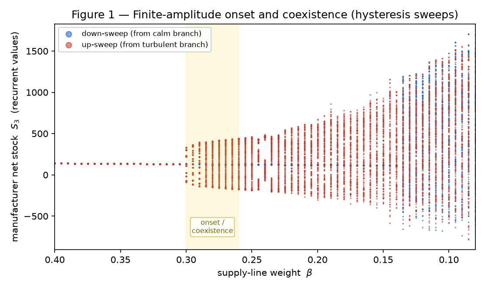
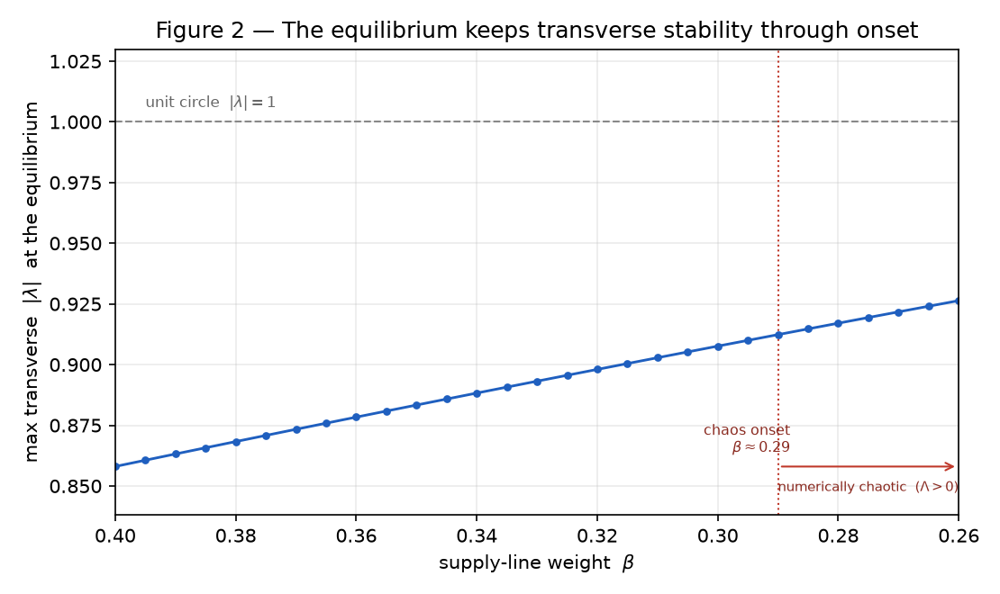

# Finite-Amplitude Onset of a Coexisting Attractor in a Conserved Piecewise-Smooth Map

> **Research-status note.** The author’s formal training is outside mathematics, and this
> work was substantially assisted by generative AI — used to explore approaches, locate
> literature, implement the numerical instruments, and test hypotheses, with its output
> treated as a lead to be verified, never as an authority. What offsets that is a
> deliberately strict methodology, made explicit throughout. The map is stated exactly and
> in full (§1), so every claim can be checked from the definition alone. The conservation
> laws are **proved**, not fitted (§2.2). All computation is deterministic Python/NumPy — no
> empirical data, no random-number generation — and reproduces bit-for-bit. Each instrument
> is validated against a closed-form case (e.g. the logistic map, \(\Lambda=\log 2\)) before
> it is applied to the model. Every claim is labelled **proved**, **numerically evidenced**,
> or **conjectural**, so the boundary of what is established is explicit rather than asserted;
> and the successive classifications in §4 were each adopted and then **discarded when
> computation refuted them**. The account below is what survived that scrutiny.

## Problem summary

We consider a deterministic, approximately \(21\)-dimensional, piecewise-smooth discrete map arising from a stock-flow-consistent model of production and ordering. The application is not considered here; the map and its bifurcation structure are the subject.

Numerical continuation in a scalar parameter \(\beta\) shows an abrupt, finite-amplitude onset of a bounded attracting set. The new attractor coexists with an interior equilibrium whose transverse spectrum remains strictly inside the unit circle. The equilibrium has three neutral directions, with eigenvalues fixed at \(+1\), induced by exact conservation relations.

The onset was successively classified as:

\[
\text{period doubling}
\;\longrightarrow\;
\text{Neimark--Sacker}
\;\longrightarrow\;
\text{border collision of the equilibrium}
\;\longrightarrow\;
\text{global nonsmooth event involving a coexisting cycle}.
\]

The first three classifications were contradicted by subsequent computation and discarded. The fourth is the present numerical interpretation, not a proved classification.

The questions are:

1. What established bifurcation framework, if any, describes the finite-amplitude creation or destruction of this coexisting invariant set?
2. Should the conserved directions be removed by restriction to invariant conservation leaves, by quotienting the associated first integrals, by a center-manifold construction, or by another reduction?
3. After that reduction, what would constitute a rigorous classification of the observed onset?

## 1. Definition of the map

There are \(n=3\) tiers. Each tier \(i\in\{1,2,3\}\) has state

\[
x_i=
\left(
I_i,\,
B_i,\,
O_i,\,
\widehat D_i,\,
Q_{i,1},\ldots,Q_{i,L}
\right),
\]

where \(I_i\) is inventory, \(B_i\) is backlog, \(O_i\) is the outstanding supply line, \(\widehat D_i\) is an adaptive demand estimate, and \(Q_{i,k}\) is material in the \(k\)-th position of an inbound delay line. With \(L=3\), the full state dimension is

\[
3(4+L)=21.
\]

The parameters used in the reported computations are

\[
\mu=100,\qquad
L=3,\qquad
\theta=0.25,\qquad
a_S=0.7,\qquad
S^\ast=100,
\]

with control parameter

\[
\beta=\frac{a_{SL}}{a_S},
\qquad\text{so that}\qquad
a_{SL}=\beta a_S.
\]

Consumer demand is constant, \(d_1=\mu\). For each tier, processed sequentially from downstream to upstream, let the arriving shipment be

\[
A_i=Q_{i,1}.
\]

The delay line shifts one position, with its newest component filled by the shipment dispatched by the upstream tier. Inventory and outstanding orders first update as

\[
I_i^+=I_i+A_i,
\qquad
O_i^-=O_i-A_i.
\]

Let \(d_i\) denote the order received from the downstream tier during the present step. Backlog becomes

\[
\widetilde B_i=B_i+d_i.
\]

The shipment is constrained by available inventory:

\[
Y_i=\min\{I_i^+,\widetilde B_i\},
\]

followed by

\[
I_i'=I_i^+-Y_i,
\qquad
B_i'=\widetilde B_i-Y_i.
\]

The demand estimate is updated by

\[
\widehat D_i'
=
\widehat D_i+\theta(d_i-\widehat D_i).
\]

Define net stock and desired supply line by

\[
S_i=I_i'-B_i',
\qquad
SL_i^\ast=L\widehat D_i'.
\]

The indicated order is

\[
u_i=
\widehat D_i'
+a_S(S^\ast-S_i)
+a_{SL}(SL_i^\ast-O_i^-),
\]

and the actual order is

\[
R_i=\max\{0,u_i\}.
\]

Finally,

\[
O_i'=O_i^-+R_i,
\qquad
d_{i+1}=R_i.
\]

For \(i<3\), \(Y_{i+1}\) enters the newest position of tier \(i\)’s delay line. At the upstream boundary, the order \(R_3\) is supplied in full after the same delay. These recurrences define a continuous piecewise-affine map

\[
F_\beta:\mathbb R^{21}\to\mathbb R^{21},
\qquad
x_{t+1}=F_\beta(x_t),
\]

with switching manifolds generated principally by

\[
u_i=0
\]

and

\[
I_i^+=\widetilde B_i.
\]

The first is the order-nonnegativity border; the second is the shipment or stockout border.

## 2. Structural properties

### 2.1 Interior equilibrium

For constant demand \(\mu\), the nominal equilibrium satisfies

\[
\widehat D_i=\mu,\qquad
I_i-B_i=S^\ast,\qquad
O_i=L\mu,\qquad
Q_{i,k}=\mu,
\]

and every tier places the order

\[
R_i=\mu.
\]

**Proved from the recurrence:** this equilibrium is interior to the order border, since \(\mu>0\).

**Numerically evidenced:** throughout the parameter interval containing the observed onset, the equilibrium also remains separated from the shipment border. Computed stockout margins are approximately \(129\), and no admissible boundary equilibrium was found.

Consequently, the observed transition is not presently attributable to the equilibrium crossing either switching manifold.

### 2.2 Conserved directions and non-hyperbolicity

For each tier define

\[
C_i
=
O_i-\sum_{k=1}^{L}Q_{i,k}.
\]

Because arrivals reduce both \(O_i\) and the delay line by the same quantity, while each new order increases both \(O_i\) and the newest delay-line component by the same quantity,

\[
C_i(F_\beta(x))=C_i(x).
\]

Thus \(C_1,C_2,C_3\) are first integrals of the map.

**Proved:** every Jacobian \(DF_\beta\), wherever it exists, has three neutral left eigendirections corresponding to these conservation functionals. At the equilibrium, the spectrum therefore contains three eigenvalues equal to \(+1\). The equilibrium is non-hyperbolic for every \(\beta\).

This raises a reduction question. Since the \(C_i\) are exact first integrals, the phase space is foliated by invariant affine level sets

\[
\mathcal L_c
=
\{x:C_i(x)=c_i,\ i=1,2,3\}.
\]

It may therefore be more natural to restrict \(F_\beta\) to the relevant \(18\)-dimensional leaf than to treat the neutral directions as ordinary center dynamics. Whether a further center-manifold or normal-form reduction is justified remains open.

## 3. Numerical observations

All reported simulations are deterministic. Demand noise is absent, and repeated runs from identical initial conditions are byte-identical. Conservation residuals remain at floating-point scale.

The following statements are **numerically evidenced, not proved**.

### 3.1 Chaos on a bounded attractor

For sufficiently small \(\beta\), trajectories remain bounded and have a positive largest Lyapunov exponent. The reported maximum is approximately

\[
\Lambda_{\max}\approx 0.054
\]

nats per iteration. Two initial conditions separated by \(10^{-6}\) show exponential separation in this regime. The Lyapunov estimator was independently tested on the logistic map at parameter \(4\), reproducing \(\log 2\).

A positive exponent observed on an unbounded trajectory is excluded from the chaos classification.

### 3.2 Finite-amplitude onset and coexistence

As \(\beta\) is varied through the onset region, the nontrivial attractor does not emerge continuously from the equilibrium. Its measured amplitude jumps from zero to approximately \(525\) over a parameter interval of width approximately

\[
\Delta\beta\approx 0.003.
\]

Within a coexistence interval, small perturbations return to the equilibrium while larger perturbations approach the nontrivial attractor. Thus the equilibrium and the finite-amplitude attractor appear simultaneously attracting.

**Figure 1.** Bifurcation diagram of the manufacturer net stock \(S_3\) under a downward
sweep from the calm equilibrium branch (blue) and an upward sweep from the turbulent
branch (red). The turbulent set appears at finite amplitude near \(\beta\approx 0.30\)
rather than growing continuously from zero, and the calm branch persists (flat locus near
\(135\)) well inside the turbulent regime — the two branches coexist over the shaded
interval (bistability / hysteresis). Deterministic; generated by
`src/chaos/outreach_figures.py`.

### 3.3 The equilibrium does not lose transverse stability

After removing the three conserved eigenvalues at \(+1\), the largest transverse modulus at the interior equilibrium stays strictly below one. It rises monotonically as \(\beta\) falls — approximately \(0.86\) at \(\beta=0.40\), \(0.908\) at \(\beta=0.30\), \(0.910\) through the onset region near \(\beta\approx 0.29\), and \(0.917\) by \(\beta=0.28\) — and is never observed to cross the unit circle. The leading pair's argument is approximately \(40^\circ\).

**Figure 2.** Largest transverse multiplier \(|\lambda|\) of the interior equilibrium
versus \(\beta\), after removing the three conserved \(\lambda=+1\) directions. It rises
monotonically as \(\beta\) falls — from \(\approx 0.858\) at \(\beta=0.40\) to
\(\approx 0.926\) at \(\beta=0.26\), passing through the chaos onset (\(\beta\approx 0.29\),
dotted) at \(\approx 0.91\) — and never reaches the unit circle. The equilibrium retains
transverse linear stability across the entire onset region. (Distinct from the one-sided
border-Jacobian oscillatory plane of §3.4, \(\approx 0.945\), evaluated on the attractor
at \(\beta=0.22\).) Deterministic; generated by `src/chaos/outreach_figures.py`.

A separate figure, approximately \(0.945\) at argument \(39.5^\circ\), appears in the one-sided Jacobian probe of §3.4. That value is *not* an equilibrium quantity: it is the modulus of the oscillatory plane of the two piecewise-affine branches evaluated at a point on the developed attractor's order border (\(\beta=0.22\)), and it is identical on both sides of that border. The equilibrium spectrum (\(\approx 0.91\)–\(0.92\) through onset) and the border-Jacobian oscillatory plane (\(\approx 0.945\)) are therefore distinct objects evaluated at distinct points, and are not in tension.

### 3.4 Contact with the switching manifold

On the developed nontrivial attractor, the manufacturer’s order is clamped to zero during approximately \(42\%\)–\(56\%\) of iterations. The shipment constraint is active during approximately \(24\%\)–\(27\%\) of iterations.

Delay-coordinate plots show an apparent invariant closed curve with flat segments along the order border, followed by frequency locking, period doubling internal to that oscillatory set, and eventual broadband dynamics with positive Lyapunov exponent.

These observations implicate the piecewise-smooth border in the evolution of the attractor. They do not by themselves identify the bifurcation that creates the attractor.

## 4. Four classifications and their refutations

### 4.1 Period-doubling of the equilibrium — discarded

A flip bifurcation would require a real equilibrium multiplier to cross \(-1\), ordinarily producing a small-amplitude period-two orbit locally.

No such crossing is observed. The attractor instead appears at finite amplitude while the equilibrium remains transversely attracting.

### 4.2 Neimark–Sacker bifurcation — discarded

A Neimark–Sacker bifurcation would require a complex conjugate pair of equilibrium multipliers to cross the unit circle.

The leading complex pair remains strictly inside the unit circle throughout the onset interval. The observed invariant-loop geometry therefore cannot be attributed to a local Neimark–Sacker bifurcation of the equilibrium.

An earlier Newton calculation produced an apparent equilibrium with spectral modulus greater than one. Subsequent feasibility checks showed it to be a virtual root of a smooth branch extension rather than an admissible equilibrium of the piecewise map. That interpretation was discarded.

### 4.3 Boundary-equilibrium border collision — discarded

The standard Nusse–Yorke or Banerjee–Grebogi boundary-equilibrium normal form requires an equilibrium to meet a switching manifold and, in its standard form, assumes the relevant fixed point is hyperbolic.

Neither condition holds here:

1. the admissible equilibrium remains interior to both observed borders; and
2. exact conservation pins three eigenvalues at \(+1\).

Moreover, a projection onto the leading complex eigenspace is not presently supported by a reduction theorem applicable to this map. Computed one-sided Jacobians differ principally in a conserved direction and a deadbeat delay-line direction, while the leading oscillatory plane is nearly unchanged across the border.

### 4.4 Global nonsmooth event involving a coexisting cycle — current conjecture

The remaining interpretation is that the finite-amplitude attracting set is created or destroyed through a global nonsmooth event, possibly a nonsmooth saddle-node or fold of invariant cycles, followed by border interaction and internal bifurcations leading to chaos.

This description is consistent with:

- finite-amplitude onset;
- coexistence and hysteresis;
- continued transverse stability of the equilibrium;
- repeated contact of the nontrivial attractor with the order border; and
- the absence of an admissible boundary equilibrium.

It is **not proved**, and “border collision of a cycle” may be terminologically or mathematically incorrect. In particular, the present computations do not yet establish the existence of a smooth or piecewise-smooth invariant circle, a saddle periodic orbit paired with the attracting cycle, or the global invariant-set geometry required for a fold theorem.

## 5. Requested guidance

The narrow classification question is:

> What established framework best describes the abrupt appearance of a finite-amplitude, constraint-riding attracting set that coexists with an interior, transversely attracting, structurally non-hyperbolic equilibrium?

A possible analytical program is:

1. prove that the conservation level sets \(\mathcal L_c\) are invariant and formulate the restricted \(18\)-dimensional map explicitly;
2. determine whether the equilibrium is hyperbolic on the tangent space of \(\mathcal L_c\);
3. identify an appropriate lower-dimensional invariant or center manifold, if one exists, rather than assuming projection onto a dominant complex eigenspace;
4. continue the attracting and unstable periodic or invariant-circle objects bounding the coexistence region;
5. locate their first contact with the switching manifold; and
6. formulate a theorem distinguishing a smooth fold of cycles, a nonsmooth fold, a grazing or border-collision event, and a boundary crisis.

The primary requests are therefore:

1. Is “global nonsmooth bifurcation of a coexisting oscillatory attractor” an appropriate provisional characterization?
2. Is restriction to the conservation leaf the correct first reduction?
3. What additional computation or proof would most decisively classify the event?

## Reproducibility

The map and numerical instruments are available in the public MIT-licensed repository
`Goldcap/Cybeersym`, principally under `src/chaos/`. They are implemented in pure
Python/NumPy and are fully deterministic: demand is constant, there is **no stochastic
input and no random-number generation**, so identical initial conditions reproduce
identical trajectories bit-for-bit. No empirical or statistical dataset enters any result
in this note — every figure and eigenvalue is generated by iterating the map defined in §1.
Each instrument is validated against a closed-form case before it is applied to the model
(the Lyapunov estimator reproduces \(\Lambda=\log 2\) on the logistic map at parameter 4;
the linearizer recovers the logistic multiplier \(2-r\) and fixed point \(1-1/r\); the 2-D
border-collision classifier reproduces three documented cases).

## Selected references

Banerjee, S., Yorke, J. A., and Grebogi, C. “Robust Chaos.” *Physical Review Letters* 80 (1998), 3049–3052.

Banerjee, S., and Grebogi, C. “Border Collision Bifurcations in Two-Dimensional Piecewise Smooth Maps.” *Physical Review E* 59 (1999), 4052–4061.

di Bernardo, M., Budd, C. J., Champneys, A. R., and Kowalczyk, P. *Piecewise-Smooth Dynamical Systems: Theory and Applications.* Springer, 2008.

Nusse, H. E., and Yorke, J. A. “Border-Collision Bifurcations Including ‘Period Two to Period Three’ for Piecewise Smooth Systems.” *Physica D* 57 (1992), 39–57.

Simpson, D. J. W. “Border-Collision Bifurcations in \(\mathbb R^N\).” *SIAM Review* 58 (2016), 177–226.

Zhusubaliyev, Zh. T., and Mosekilde, E. *Bifurcations and Chaos in Piecewise-Smooth Dynamical Systems.* World Scientific, 2003.
