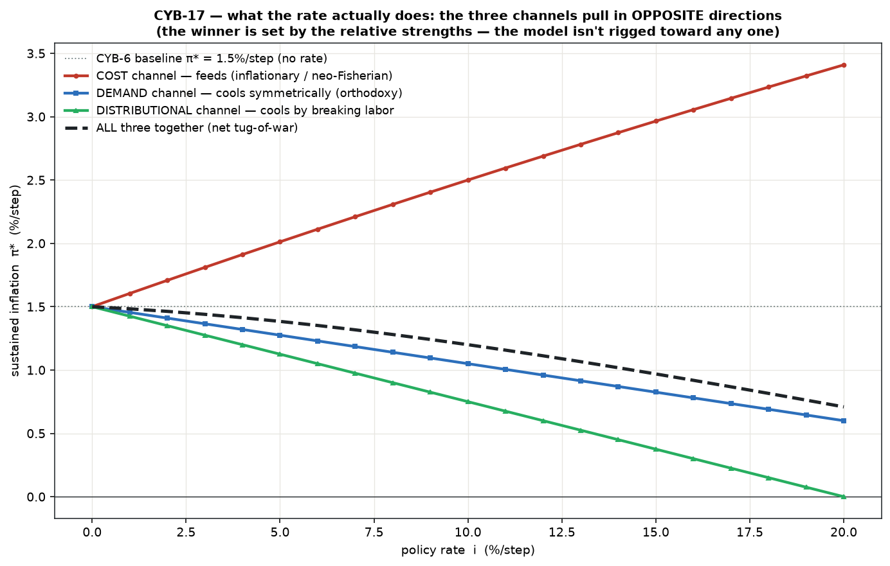
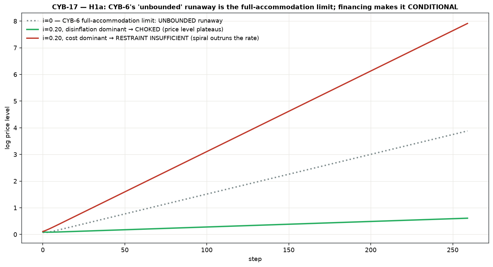
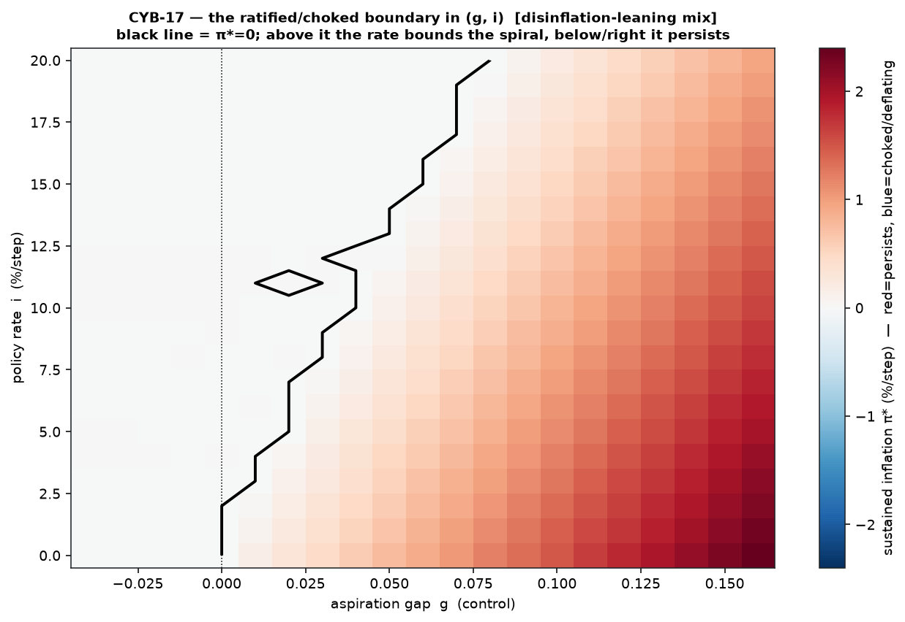
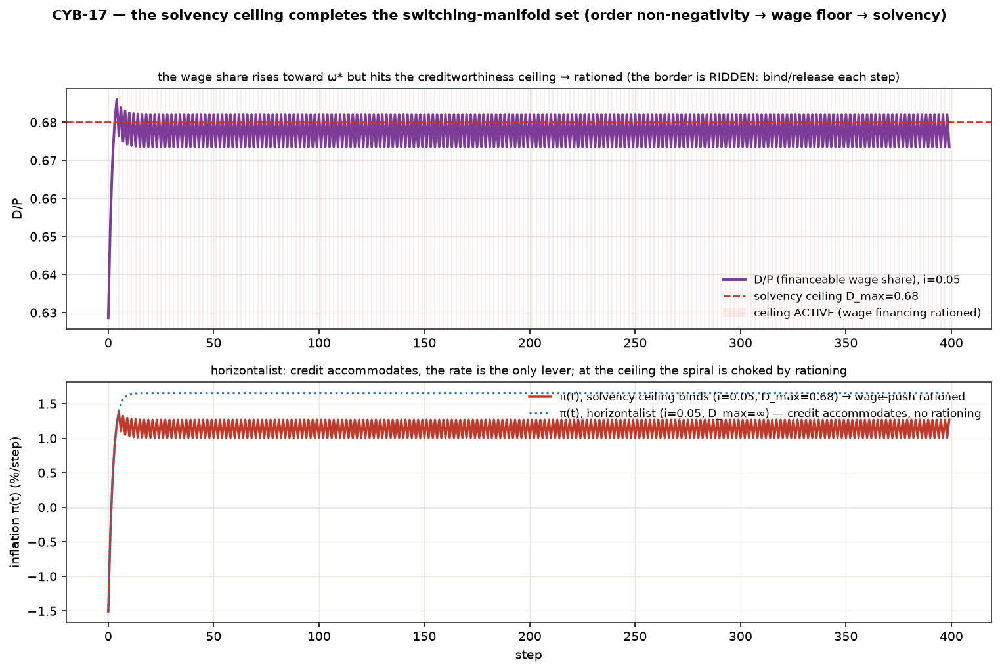

# Accommodation — v0 (the first sustaining channel, CYB-17)

CYB-1/2 built **recursion**, CYB-6 **conflict** — the two *transmission* channels. This
is the first **sustaining** channel: **accommodation**, the money/credit ratification a
sustained rise in the *nominal* level requires. It attaches to the **bare CYB-6 conflict
layer** (not the CYB-10 coupling — isolate one thing) and adds a **policy rate `i`** as
the conditioning parameter.

Standalone; **reuses CYB-6 unchanged** (composed, driven through effective parameters).

```bash
cd src/accommodation
python3 run_v0.py   # regression → channel decomposition → H1a → boundary map → solvency/monetarist
```

## The reframe (why this ticket exists)

CYB-6's marquee finding — an **unbounded** nominal price-level runaway for gap `g > 0` —
was produced with **no money and no credit in the model**. Nothing had to be financed, so
nothing could choke. That "unbounded" was therefore never a law of the conflict mechanism;
it was an **unnamed assumption** hiding in plain sight — the **full-accommodation limit**,
where financing the spiral is costless and unconstrained. Real economies never sit at that
corner.

So accommodation v0 is not "bolt a monetary sector onto a working spiral." It is the same
move the project keeps making — **naming the hidden constraint**: order non-negativity was
the secret switching manifold in CYB-2, the conservation clamp in CYB-4, the wage floor in
CYB-6. Here it is the **financing constraint**. Once the nominal wage bill must be financed
by credit at a rate (working-capital / wage-fund finance; circuit theory, Graziani),
CYB-6's runaway stops being unconditional.

## The build (one new structure: the financing/ratification loop)

Firms borrow to cover the wage bill; debt stock `D` (revolving wage fund + capitalized
uncovered interest); the interest flow `i·D` is income to a **passive rentier-bank pool**
whose asset is `D`. The conserved flow identity **extends** from CYB-6's `wage + profit = 1`
to **`wage share + interest share + retained-profit share = 1`** (retained is the residual
claimant, now after *both* wages and interest). The rate then acts through **three channels**
(all present — fewer would rig the answer), each a tunable strength:

| channel | mechanism | direction |
|---------|-----------|-----------|
| **Cost** | interest is a cost of production; firms defend margin *net of interest* ⇒ `ω_f_eff = ω_f − c·(i·D/P)` raises the effective gap | **inflationary** (neo-Fisherian / cost-push "price puzzle") |
| **Demand** | higher `i` → slack → damps claim adjustment **symmetrically**: `α_w, α_p ×(1 − b·i)` | **disinflationary, symmetric** (orthodoxy's mechanism) |
| **Distributional** | the same slack breaks the **workers'** side: `ω_w_eff = ω_w − a·i` | **disinflationary, by moving the gap in capital's favor** |

## The result

`ω_f = 0.65`, `g = 0.10`, `α_w = α_p = 0.30` (CYB-6 base; π* = 1.5%/step with no rate).

### 1. What the rate actually does — the channel decomposition (headline)

The three channels pull in **opposite directions**, and the net effect of the rate is a
**tug-of-war whose winner is set by the relative strengths** — the model is *not* rigged
toward any one. At `i = 0.10` (baseline π* = 1.5%/step):

| channel | π* | vs baseline |
|---------|----:|----:|
| cost only | +2.50 %/step | **+1.00** (feeds) |
| demand only | +1.05 %/step | −0.45 (cools symmetrically) |
| distributional only | +0.75 %/step | −0.75 (cools by breaking labor) |
| all three | +1.20 %/step | −0.30 (net, these strengths) |



Only the **distributional** channel drives π* cleanly toward **zero** (it *closes the gap*);
the **demand** channel merely cools proportionally (it scales the rate down but leaves the
distribution `ω*` unchanged); the **cost** channel *feeds*. **Any of the three can dominate**
— which does is an empirical/parameter question, not something this model decides for you.

### 2. H1a — CYB-6's runaway is now conditional

Financing makes "unbounded" contingent. Same subthreshold-vs-spiral setup, three fates:
* `i = 0`: the **CYB-6 full-accommodation limit** — the unbounded runaway, recovered exactly.
* `i = 0.20`, disinflation dominant: **choked** (the price level nearly plateaus).
* `i = 0.20`, cost dominant: **restraint insufficient** — the spiral *outruns* the rate
  (the rate *feeds* it faster).



So **accommodation is the sustaining condition**: a high rate bounds the spiral **only if
its disinflationary channels dominate its cost channel**. "There is always a restraint"
(`i>0`) is not "the restraint always bounds it" — the model reaches, by construction, a
region where the rate is present, finite, and insufficient (real: indexed hyperinflations,
hikes that didn't take). The ratified/choked boundary in `(g, i)`:


### 3. The solvency ceiling completes the switching-manifold set

Accommodation is elastic at rate `i` only up to a **creditworthiness ceiling** `D/P ≤ D_max`
(banks won't finance a wage bill above `D_max`·income); past it, credit is **rationed** and
the wage-push is choked. This is a one-line clamp on an existing quantity — the same shape
as CYB-6's wage floor — and it **completes the set**: *order non-negativity → conservation
clamp → wage floor → solvency ceiling*. The real economic constraint *is* the border. Here
the border is literally **ridden** (bind/release each step — a limit cycle on the manifold,
echoing CYB-2). The Minsky credit-crunch cascade that fires off this tripwire is deferred.


### 4. The monetarist knob — inert as a lever, real as a crunch

Horizontalist is primary: the CB sets `i`, the credit **quantity is endogenous** (the lever
is inert). Putting the **monetarist money-growth cap `μ` physically in the room** (rather
than asserting it dead): capping money(≈wage-bill) growth *does* bound the cost-fed spiral
(π* 2.5 → 0.5 %/step) — **but only by rationing credit**, i.e. a credit crunch, a real /
distributional cut, not a clean nominal lever. Forcing the quantity is the horizontalist's
whole point about why it isn't free.

## Why it's real and not a composition artifact

1. **Full-accommodation-limit regression byte-identical.** At `i→0`, `D_max→∞`, cost off,
   the module reproduces CYB-6 (W, P) **exactly** (`0.0`), *including* the unbounded runaway
   — the financing loop is the only new thing (the anchor `κ=0` played in CYB-10). The
   costless steady state reduces to `π* = (α_w·α_p/(α_w+α_p))·g` (Rowthorn–Lavoie).
2. **Extended conservation, throughout.** `wage + interest + retained = 1` and the debt
   bookkeeping `ΔD = borrowing − repayment` (rentier asset = firm debt) hold to `≤ 2e-16`,
   including mid-spiral and mid-choke.
3. **Determinism.** σ=0, pure function of state; byte-identical reruns.

## Scope (v0 excludes) — and the forward-links

* **Bare CYB-6 substrate** — accommodation-on-coupled (CYB-10) is a follow-up.
* **The Minsky credit-crunch / forced-deleveraging cascade** — the v0 solvency ceiling is a
  *static* tripwire; the cascade that trips off it is the next (big) ticket.
* **Reflexivity / expectations / indexation** — the other sustaining channel, later.
* **Passive rentier pool** (no spending/optimizing); one good; deterministic.

The normative consumer of this build — *the interest rate as conditioning, not control; the
monetarism critique* — is **CYB-16**, which stays gated on external (mathematician → economist)
buy-in. This ticket is its descriptive vehicle and is **not** gated; it makes no "heterodox
tools work better" claim (a separate build). It only characterizes, honestly, what the rate does.

## Files

- `model.py` — `AccommodationEconomy`: composes bare CYB-6 + the working-capital financing
  loop (debt `D`, interest `i·D`, passive rentier pool); the three rate-channels as effective
  parameters; the solvency-ceiling + monetarist clamps; the extended three-way conservation assert.
- `run_v0.py` — regression → channel decomposition → H1a (runaway conditional + boundary map)
  → solvency border + monetarist comparison.
- `figures/` — channel decomposition (headline); runaway-now-conditional; `(g,i)` boundary;
  solvency border.

## Anchors

Endogenous money / horizontalism (Moore 1988; Kaldor; Lavoie). Circuit theory / wage-fund
finance (Graziani). Cost channel of monetary policy (Barth & Ramey 2001; the "price puzzle").
Conflicting claims + distribution (Rowthorn 1977; Lavoie). MMT rate view (Mosler; Kelton) —
the *normative* consumer (CYB-16), noted, not built. Source-verified in a later grounding ticket.
