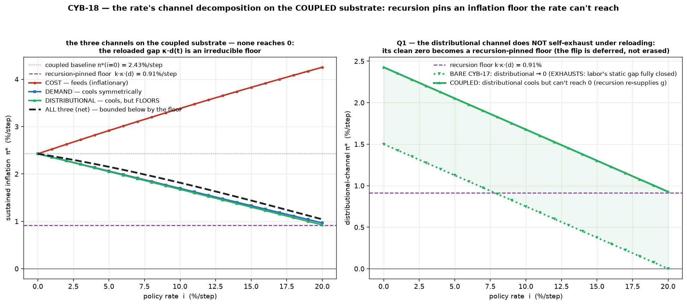
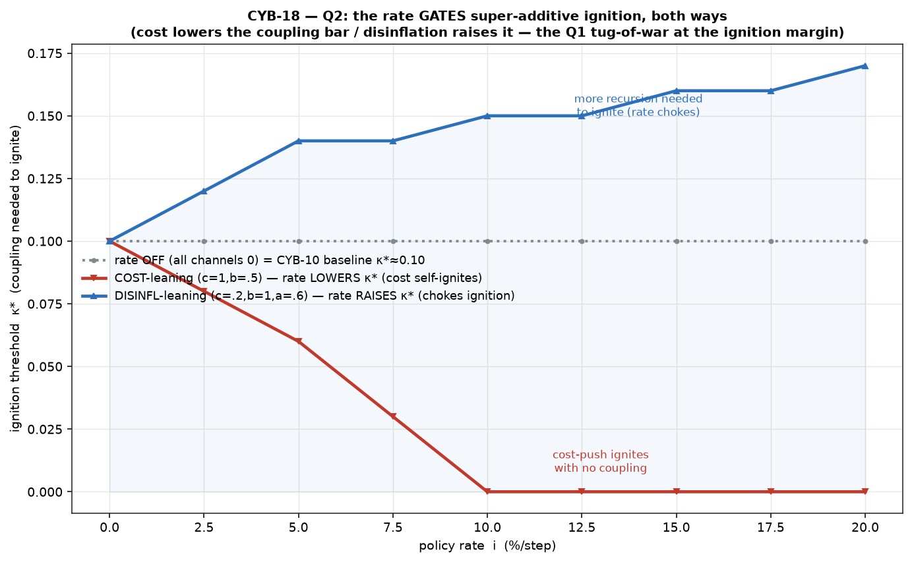
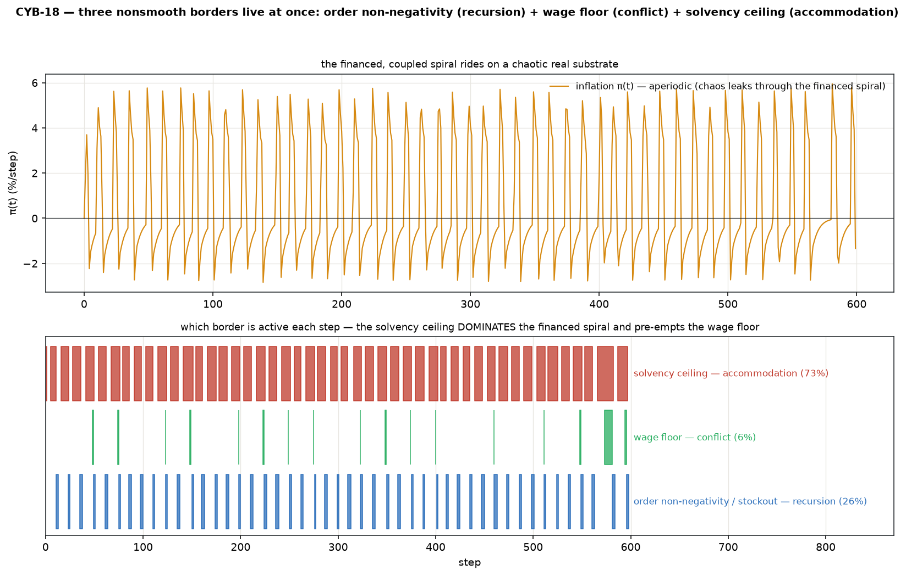

# Accommodation on the coupled substrate — v0 (the full egg-faithful stack, CYB-18)

CYB-17 dropped the **accommodation** channel (credit ratification of the wage bill at a
policy rate `i`) on the *bare* CYB-6 conflict layer. This ticket drops that **same
machinery, unchanged**, on the *coupled* recursion×conflict substrate (CYB-10) — the
egg-faithful full stack where a conserved 3-tier supply chain amplifies a real deficit
`d(t)` that lifts the aspiration gap `g(t) = g0 + κ·d(t)`, then the conflict spiral runs,
now with the wage bill financed. **Inheritance build — no new mechanism.**

Standalone; **reuses CYB-10 (`coupling/`) and CYB-17 (`accommodation/`) unchanged** — it
only reads the chain's deficit and reloads accommodation's exogenous base gap each step.

```bash
cd src/accommodation_coupled
python3 run_v0.py   # two anchors → coupled decomposition (headline) → ignition-vs-rate → three borders
```

## The one new line (why this is composition, not a rewrite)

CYB-17's `AccommodationEconomy` already drives a conflict layer off a **fixed** base gap
`g0` and perturbs it with the rate's three channels. CYB-10 drives that same base gap with
recursion: `g(t) = g0 + κ·d(t)`. So we **reload accommodation's base** each step from the
chain's deficit (lower ω_f0 by κ·d, hold ω_w0 fixed — exactly CYB-10's "lower ω_f, hold
ω_w"), then let the unmodified accommodation step apply cost/demand/distributional +
financing on top. **Recursion supplies the gap; accommodation finances and (dis)inflates it.**

## The two headline questions (answerable only on the coupled substrate)

### Q1 — does the distributional channel still self-exhaust when recursion re-loads `g`? **No — it's deferred, and its clean zero becomes a recursion-pinned floor.**

On bare CYB-6 (CYB-17) the **distributional** channel drove `π*` cleanly to **zero**: it
lowers workers' target `ω_w` by `distrib_a·slack`, and once that slack covers the *static*
gap `g0` the gap is closed, labor's claim is broken, `g` stops responding — the channel
**exhausts**, its marginal disinflation decays to 0, and that decay is exactly what let the
**cost** channel take over at high `i` (the restraint-insufficient / cost-flip region).

On the **coupled** substrate recursion re-supplies the gap **every period** via `κ·d(t)`.
So the distributional channel never runs out of gap to work on — but it also **can never
win**: it can neutralise the static `g0`, but not the recursively-reloaded portion. Its
clean zero is replaced by a **positive inflation floor**

> **floor ≈ k·κ·⟨d⟩ = 0.91 %/step** — inflation the rate *cannot* reach through *any* channel.

Measured (channel-isolated, `i = 0.20`, where the bare channel is fully exhausted):

| distributional-only channel | bare CYB-17 | coupled (κ=0.20) |
|---|---:|---:|
| `π*` at `i=0.20` | **−0.00 %/step** (exhausted → 0) | **+0.93 %/step** (floored ≈ `k·κ·⟨d⟩`) |



And the **restraint-insufficient / cost-flip region survives and is *hotter*.** Recursion
lifts the *entire* `π*(i)` surface (baseline `π*(i=0)`: bare **+1.50** → coupled **+2.43
%/step**), so a cost-dominant mix at `i=0.20` runs **+3.07** (bare) → **+3.83 %/step**
(coupled). The disciplined verdict: on the coupled substrate the rate is **even less able
to stabilise** — the distributional channel no longer exhausts (it stays live), but nothing
drives inflation to zero while recursion keeps re-supplying scarcity. **The rate becomes
more of a redistributive tool and less of a stabiliser.**

### Q2 — does accommodation gate super-additive ignition? **Yes — both ways; the channel mix decides which.**

CYB-10's headline was **super-additive ignition**: a subthreshold conflict layer (`g0<0`,
dissipates alone) ignites only when the chain's amplification (`κ ≥ κ*`) drives `g` across
0. Inserting the financing constraint + rate moves that ignition threshold `κ*(i)`:

* **rate off** (all channels 0): `κ* = 0.10`, flat in `i` — **exactly the CYB-10 baseline**
  (the rate acts *only* through its three channels; with them off it does nothing).
* **cost-leaning** mix: raising `i` **lowers** `κ*` (0.10 → **0.00** by `i=0.10`) — the
  cost-push markup defence widens the gap past 0 on its own, so **the rate self-ignites the
  spiral with no coupling at all**.
* **disinflation-leaning** mix: raising `i` **raises** `κ*` (0.10 → **0.17**) — you can
  **choke ignition at the financing stage**; more recursion amplification is then required.



So the rate **gates** super-additive ignition — the same tug-of-war as Q1, now at the
ignition margin: **cost lowers the bar, disinflation raises it.**

## The two regression anchors — both byte-exact (the load-bearing discipline)

Two axes of composition, one anchor each; together they prove the build added nothing but
the two interactions already validated in isolation.

* **`κ = 0` ⇒ CYB-17 exactly.** Decouple the chain and the module reproduces standalone
  accommodation-on-bare-CYB-6 (`W`, `P`, `D`) to **`0.0`** — a live financed spiral with all
  three channels on.
* **`i→0, D_max→∞, cost-off` ⇒ CYB-10 exactly.** The full-accommodation limit reproduces the
  coupled transmission model (chain state ⊕ conflict `ω`, `P`) to **`0.0`**, including the
  ignited regime.

## Three nonsmooth borders live at once — the switching-manifold set, financed and coupled

Order non-negativity (recursion), the wage floor (conflict), and the solvency ceiling
(accommodation) are **all active simultaneously** (regime `g0=−0.02`, `κ=0.20`, `i=0.05`,
`D_max=0.58`):

| border | module | active |
|---|---|---:|
| order non-negativity / stockout | recursion | 26 % of steps |
| wage floor | conflict | 6 % of steps |
| **solvency ceiling** | **accommodation** | **73 % of steps** |



**Dominance + interaction:** the **solvency ceiling rules** the financed spiral; the stockout
border is the ever-present recursion substrate; the **wage floor is rare — and rare *because*
the solvency ceiling gets there first.** The ceiling caps the financeable wage push, so the
share seldom overshoots into the region where the (downward) wage floor would bind. The two
share a boundary and the ceiling **pre-empts** the floor — they interact, they don't just
coexist.

## Why it's real and not a composition artifact

1. **Both decoupling limits recover their parents exactly** (`0.0`; see anchors above).
2. **All THREE conservation laws green at once** — goods conservation (chain) + the three-way
   income identity `wage + interest + retained = 1` + debt bookkeeping `ΔD = borrowing −
   repayment` (accommodation, which folds in CYB-6's share partition) — worst residual
   **`1e-15`** in the ignited/coupled/financed regime.
3. **Determinism.** σ=0, pure function of state; byte-identical reruns.

## Scope (v0 excludes) — and the live forward-links

* **Finance the wage bill only** (inherited from CYB-17). Financing the recursion/supply-chain
  tiers (inventory / ordering working capital) is a **new mechanism, deferred** — flag it if
  wanted and it gets its own ticket.
* **One-way coupling only** (inherited from CYB-10); bidirectional still out.
* **Minsky credit-crunch cascade** — the solvency ceiling is still a *static* tripwire; the
  dynamic deleveraging that fires off it is **[CYB-19]**.
* **Reflexivity / expectations / indexation** — the other sustaining channel is **[CYB-20]**.
* Passive rentier pool; one good; deterministic.

## Files

- `model.py` — `AccommodationCoupledEconomy`: composes `ChaosChain` (CYB-1/2, unchanged) +
  `AccommodationEconomy` (CYB-17, unchanged, which itself owns the conflict layer + financing
  loop) via the CYB-10 reload `g(t)=g0+κ·d(t)`; all three conservation asserts live inside
  their reused submodules.
- `run_v0.py` — two byte-exact anchors → coupled channel decomposition (Q1 headline: the
  recursion-pinned floor / deferred exhaustion) → ignition-vs-rate map (Q2) → three-border
  dominance + conservation + determinism.
- `figures/` — coupled channel decomposition vs CYB-17; ignition boundary vs `i`; three-border
  dynamics.

## Anchors (no new literature — inherited from the two parents)

Recursion: Sterman 1989; Mosekilde & Larsen 1988 (beer-game chaos). Conflict/distribution:
Rowthorn 1977; Lavoie. Endogenous money / horizontalism: Moore 1988; Kaldor; Lavoie. Circuit
theory / wage-fund finance: Graziani. Cost channel of monetary policy: Barth & Ramey 2001
(the "price puzzle"). The normative consumer — *the rate as conditioning, not control* — is
**CYB-16**, gated on external buy-in; this build only characterises, honestly, what the rate
does on the full stack.
