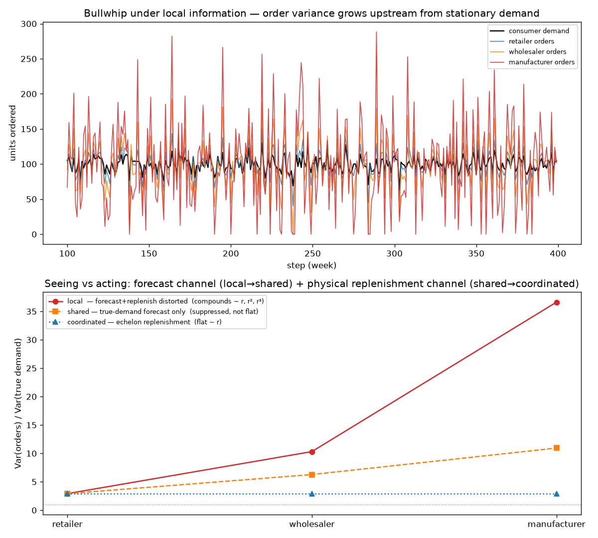

# Bullwhip — v0 (standalone)

The smallest honest demonstration that a 3-tier supply chain **amplifies order
variance** — the bullwhip effect — purely from *demand-signal processing under
local information*: each tier estimates the demand mean from the orders it sees
(a moving-average forecast) and runs an order-up-to policy whose target moves
with that estimate. Lead time multiplies the effect. This isolates the
**recursion** channel of [`THESIS.md`](../../THESIS.md) — propagation through
input-output linkages — with no price-expectations confound.

Standalone (shares no code with the egg engine on purpose): it is the reference
**oracle** the integrated SFC version must later reproduce.

```bash
cd src/bullwhip
python3 run_v0.py        # regression + Chen validation + killer experiment + figure
```

## The result

`mu=100, sigma=10, L=2, p=5, z=2, T=400, warmup=100, seed=0`

Three modes that separate **seeing** (information sharing) from **acting**
(coordinated replenishment):

| mode | what's de-distorted | result |
|------|---------------------|--------|
| `local` | nothing — forecast off received orders, replenish them | full compounding |
| `shared` | the *forecast* only (off true demand), still replenish received orders | suppressed, not flat |
| `coordinated` | *both* — echelon replenishment against true end-demand | flat |

**Per-stage** — `Var(orders placed) / Var(demand received)`:

| mode        | retailer | wholesaler | manufacturer | chain (product) |
|-------------|---------:|-----------:|-------------:|----------------:|
| local       | 2.92 | 3.53 | 3.55 | **36.6×** |
| shared      | 2.92 | 2.15 | 1.74 | **10.9×** |
| coordinated | 2.92 | 1.00 | 1.00 | **2.9×** |

**Cumulative** — `Var(orders) / Var(TRUE consumer demand)` — the compounding signature:

| mode        | retailer | wholesaler | manufacturer |
|-------------|---------:|-----------:|-------------:|
| local       | 2.92 | 10.32 | **36.62** |
| shared      | 2.92 |  6.28 | **10.94** |
| coordinated | 2.92 |  2.92 | **2.92** |

Same seed, same stationary consumer demand. The chain amplification decomposes
cleanly: **local 36.6× → shared 10.9× → coordinated 2.9×**.

- **local → shared** (the *forecast / information* channel): sharing true demand
  for forecasting cuts compounding ~3.3×, but does **not** flatten it.
- **shared → coordinated** (the *physical replenishment* channel): only when each
  tier also *replenishes* against true end-demand (echelon base-stock, not
  installation) does the cumulative ratio go **flat** at ≈ r — each stage sits at
  the single-stage Chen ratio, no compounding.
- **coordinated ≈ the single-stage ratio** (2.92, matching the Chen sweep below):
  the irreducible, legitimate inventory response to demand noise that *no*
  coordination removes. The bullwhip — the *compounding* — is gone.

The lesson: **seeing true demand is not enough; you have to act on it.** Sharing
information without changing the replenishment policy leaves most of the residual.
This is the installation- vs echelon-base-stock distinction made measurable.

Robust, not a lucky seed: across seeds 0–7, local **37.7 ± 2.0×**, shared
**11.2 ± 0.5×**, coordinated **2.9 ± 0.1×** — strict `local > shared > coordinated`
on every seed. Determinism is guarded (same seed → identical arrays).



## Why it's real and not a bug (the three validations)

1. **Frozen-forecast regression.** Hold the forecast at the true mean (constant
   `S`, the `p→∞` limit) and the ratio is **1.000 at every stage**. A constant
   order-up-to level passes demand through one-for-one for *any* lead time — so
   the amplification is the moving-average update, provably not the harness.

2. **Quantitative match to Chen et al. (2000).** A clean single linear stage
   facing i.i.d. demand matches the analytic closed form
   `1 + 2L/p + 2L²/p²` to ~1%:

   | L | p | measured | Chen(L+1, p) |
   |--:|--:|---------:|-------------:|
   | 2 | 5 | 2.945 | 2.920 |
   | 4 | 10 | 2.495 | 2.500 |
   | 1 | 1000 | 1.004 | 1.004 |

   All predicted trends hold: rises with `L`, falls with `p`, → 1 as `p → ∞`.
   (Measured tracks `Chen(L+1, p)`, not `Chen(L, p)`: our `S_t` scales with
   `L+1`, the lead **+ review** period — a one-step convention offset from the
   textbook `L`, not a discrepancy in the mechanism.)

3. **Conservation.** Goods are created only by the external supplier, destroyed
   only by consumption. The invariant
   `injected − consumed == Σ inventories + Σ in-transit` holds to **3.4e-11**
   every step. Variance amplifies *while goods conserve* — leak would be a bug;
   conserve-but-amplify is the phenomenon.

## Why three modes (a spec correction the model earned)

The original spec predicted two modes: local compounds, shared goes *flat ≈ r*.
The sim refuted "flat" — shared only **suppressed** compounding (2.9 → 6.3 → 10.9,
still rising), because sharing the *forecast* de-distorts only one of two
channels: a tier's inventory position is still depleted by the distorted orders
it physically receives. That refutation (flagged as a question, not silently
✅'d) split the original `shared` into two: `shared` (see true demand) and
`coordinated` (also *act* on it, echelon-style). The three-way contrast — and its
decomposition into a forecast channel and a physical-replenishment channel — is a
sharper, more publishable result than the original binary. Same discipline as the
egg model: let the data refute the spec, and the correction is the finding.

## Literature check

- **Quantitative anchor — Chen, Drezner, Ryan & Simchi-Levi (2000),
  *Quantifying the Bullwhip Effect in a Simple Supply Chain*, Management Science
  46(3):436–443.** Their closed form is the rigorous target the sim is validated
  against above (~1%).
- **Qualitative gut check — Lee, Padmanabhan & Whang (1997), *The Bullwhip Effect
  in Supply Chains*, Sloan Management Review.** P&G's Pampers: retail
  consumption was steady, distributor orders swung more, and P&G's own orders to
  its supplier (3M) swung more still — order variability amplifying up the chain.
  The original account is qualitative (no clean variance ratio to quote), but the
  *direction and shape* — multi-fold per-stage amplification compounding to one-
  to-two orders of magnitude across a chain — is exactly our 37× over three
  tiers. The Beer Game (Sterman 1989) reproduces the same multi-fold per-tier
  amplification from steady retail demand.

## Files

- `model.py` — the 3-tier system + step loop; `local_info`/`shared_info`/
  `coordinated` modes; `moving_average`/`frozen` forecast; conservation assert.
- `measure.py` — `bullwhip_ratio`, the per-stage/cumulative report, and
  `chen_single_stage` (the closed form).
- `run_v0.py` — regression → Chen sweep → killer experiment → figure.
- `figures/cybeersym_bullwhip_v0.png` — the amplification plot.

## Scope (v0 deliberately excludes)

Demand *estimation* is in (the recursion-channel cause); price *anticipation* is
out (that is reflexivity — a different `THESIS.md` cell, deferred to v1). No
batching (a separate, forecast-free bullwhip source that does **not** vanish
under shared info, so it can't serve the killer experiment), no promotions, no
capacity limits. Three tiers exactly — generalize on contact, not on spec.
