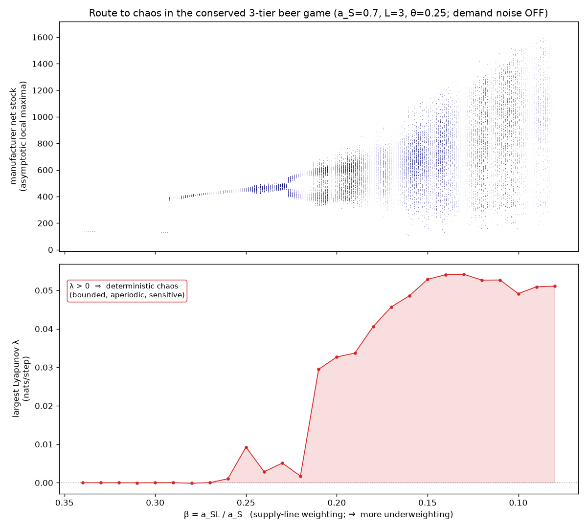
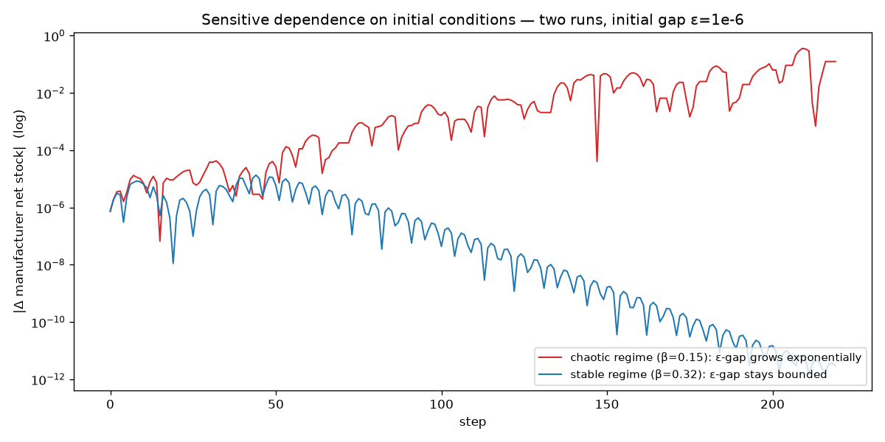
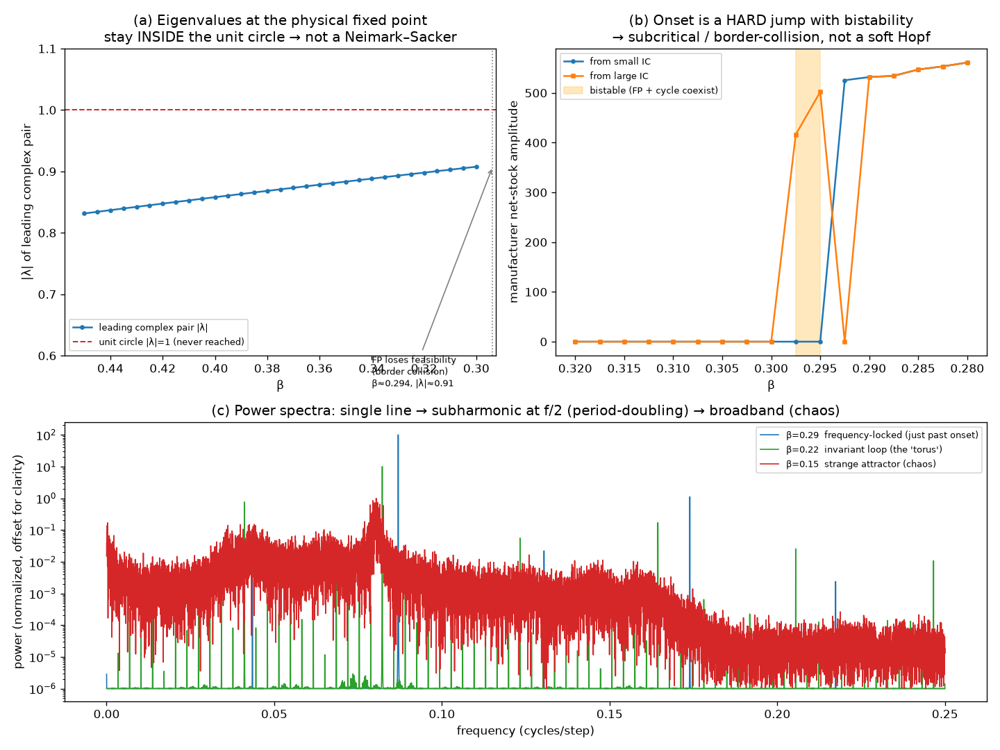
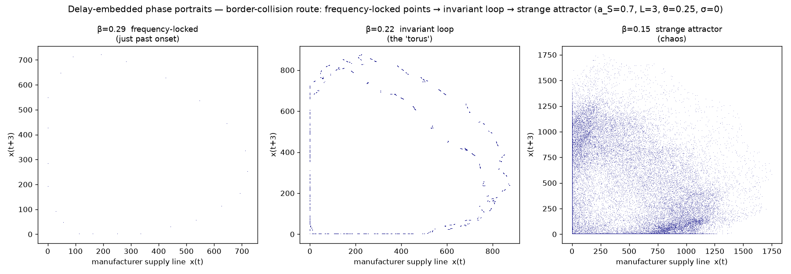

# Chaos — v0 (standalone)

CYB-1 proved **amplification** — a stationary demand blip rings *louder* up the
chain (linear, bounded). Amplification is not chaos. This module asks the sharper,
*measurable* question and answers it: does the same conserved 3-tier supply chain,
given a realistic **nonlinear** ordering rule, generate **deterministic chaos**
endogenously — bounded aperiodic trajectories with **sensitive dependence on
initial conditions** and a **positive largest Lyapunov exponent** — as one
behavioural parameter varies?

It does. **This is measured chaos, not complication.** A complicated model
producing wiggly output proves nothing; chaos is a specific claim, defined by
λ > 0 on a bounded attractor, and it is *measured* here with an instrument that is
itself validated against a map of known exponent first.

```bash
cd src/chaos
python3 lyapunov.py      # instrument self-test: logistic r=4 -> λ = ln 2
python3 bifurcation.py   # instrument self-test: logistic period-doubling cascade
python3 linearize.py     # instrument self-test: recovers logistic multiplier 2−r
python3 run_v0.py        # the chaos result (λ>0) + the bifurcation/sensitivity figures
python3 run_route.py     # names the route: eigenvalues + bistability + phase portraits
```

## The nonlinearity (the chaos generator)

CYB-1's near-linear order-up-to rule is replaced by the documented
**anchoring-and-adjustment** ordering heuristic (Sterman 1989), per tier each step:

```
D_hat   <- D_hat + θ·(received - D_hat)              # adaptive demand forecast
S       =  inventory - backlog                        # current NET stock
SL      =  on_order                                   # current supply line (in pipeline)
SL_star =  L · D_hat                                  # desired supply line
order   =  max(0, D_hat + a_S·(S_star - S) + a_SL·(SL_star - SL))
```

The behavioural control parameter is the **supply-line weight**

```
β = a_SL / a_S
```

* **β = 1** — the decision-maker fully credits orders already in the pipeline;
  does not re-order for gaps already on the way → **stable**.
* **β < 1** — **supply-line underweighting**, the documented human bias (Sterman's
  subjects systematically ignored the pipeline): the tier re-orders for gaps it
  has *already addressed*, over-corrects, oscillates. As β falls → **chaos**.

The `max(0, ·)` (orders can't be negative) is a genuine nonlinearity; combined
with the lead-time delays and the feedback it is what makes chaos *possible*. A
purely linear rule can only decay or blow up — it cannot sustain a bounded
aperiodic attractor.

**β is THE knob.** At high β even an aggressive inventory-adjustment `a_S=1.3`
stays stable; `a_S` alone does not destabilize the chain. Underweighting the
supply line is what tips it over — the behavioural story, made measurable.

## The result

`a_S=0.7, L=3, θ=0.25`, demand noise **OFF** (σ=0), perturbed off the fixed point
by a one-time initial-condition offset. Sweep β downward (← stable, → more
underweighting):



* **Top — bifurcation diagram.** A single fixed point (net stock ≈ 135) holds for
  β ≳ 0.30, loses stability near β ≈ 0.29 into a narrow band, and broadens into a
  **chaotic smear** as β falls. The attractor stays **bounded** the whole way (it
  does not run away).
* **Bottom — the load-bearing measurement.** The largest Lyapunov exponent is
  **λ ≈ 0 on the frequency-locked invariant loop and turns robustly positive
  (λ up to +0.054 nats/step) below β ≈ 0.26**, where the loop breaks down. The sign
  change *locates* the onset of chaos. Chaos is *defined* by this, not by the
  picture looking busy.



* **Sensitive dependence (the butterfly).** Two runs whose initial conditions
  differ by ε = 1e-6: in the chaotic regime (β=0.15) the gap **grows
  exponentially** (×10⁵ over ~200 steps — a straight line on the log axis, the
  visual signature of λ>0); in the stable regime (β=0.32) the same gap **decays**
  back toward the fixed point (→ 1e-11). Same model, opposite verdict, set only by β.

## The route, named rigorously: a border-collision bifurcation (two spec corrections)

The model earned **two** corrections, each by direct measurement (`run_route.py`).

**First correction.** The spec's criterion 1 predicted a *pristine logistic-style
period-doubling cascade*. Refuted: the onset is not a gentle flip to period-2.

**Second correction.** The natural next guess — a **smooth Neimark–Sacker** (the
discrete Hopf, a complex eigenvalue pair crossing the unit circle into a
quasiperiodic torus) — is *also* refuted by direct measurement. Three independent
confirmations all point elsewhere:



1. **(a) The equilibrium's eigenvalues never reach the unit circle.** Linearizing
   the one-step map at the *attracting* fixed point (`linearize.py`, fixed point
   found by honest iteration) and tracking the leading complex pair as β falls: it
   stays at **|λ| ≈ 0.91 (∠ ≈ 40°)** clean through the onset region and **never
   reaches |λ| = 1.** The equilibrium undergoes **no smooth local bifurcation** — no
   Neimark–Sacker, no flip. (The *load-bearing* catch: an earlier Newton solve found
   a root with |λ|=1.13 — but that was a **virtual** equilibrium on the *linear
   extension* of a piece, outside its region of validity, with a negative supply
   line. Mistaking it for real would have *falsely confirmed* a Neimark–Sacker. The
   physical fixed point, found by iteration, is the |λ|≈0.91 one.)
2. **(b) Onset is a hard jump with bistability — the heart of the result.** The
   turbulent attractor amplitude jumps **0 → ~525 over Δβ ≈ 0.003** (discontinuous,
   not continuous-from-zero), and it **coexists** with the still-stable equilibrium:
   from a small initial perturbation the economy sits calm at the fixed point; from a
   large one it lands on the turbulent attractor. The equilibrium is never destroyed
   — a constraint-riding attractor is simply **born alongside it**.
3. **(c) Which border, and the geometry.** Instrumenting the developed attractor:
   the dominant active constraint is **order non-negativity** (`max(0, order)` — the
   manufacturer orders zero **42–56 %** of steps), with the **stockout** floor
   (`min`-ship) secondary (~24–27 %). Delay-embedded phase portraits (below) show the
   closed invariant loop Desktop's intuition called for — its flat segments **riding
   the `order ≥ 0` border** (the piecewise-smooth fingerprint) — breaking down into a
   strange attractor. Spectra: a single sharp line → a **subharmonic at f/2**
   (period-doubling *within* the loop) → broadband.



**Verdict: a BORDER-COLLISION / piecewise-smooth route** (Zhusubaliyev & Mosekilde).
The equilibrium stays linearly stable; a bounded, constraint-riding attractor
(invariant loop → frequency-locking / period-doubling → **strange attractor**, λ>0)
is **born abruptly and coexists** with it. The clamps (`max(0, order)`,
`ship = min(inventory, backlog)`) are not a numerical nuisance; they **are** the
mechanism. The structural reason a clean logistic cascade never appears: this is a
~21-D *piecewise-smooth* delay system —
clean period-doubling cascades are a low-dimensional-*smooth*-map phenomenon.

Same discipline as CYB-1's "information sharing suppresses but does not flatten":
let the data refute the framing — *including a framing handed over by the other
agent* — and the correction is the sharper, more citable result. The **load-bearing
claim is unaffected**: bounded + aperiodic + λ>0 + deterministic + conserved =
deterministic chaos, measured.

## The economic reading (the distinctive part)

The borders are not numerical kinks — they are **real economic constraints**:
`max(0, order)` is **order irreversibility** (you can't *un-order* stock already
requested), and `ship = min(inventory, backlog)` is the **stockout floor** (you
can't ship what you don't have). The measurement above says the turbulence is born
**dominantly at the order-irreversibility border** (the manufacturer ordering zero
42–56 % of the time on the attractor). So the finding, stated plainly:

> **The chaos appears when the chain's trajectory starts colliding with its own
> hard constraints — most of all the inability to send stock back up the line. The
> non-smoothness *is* the economics.**

This is exactly what smooth / equilibrium models — and most analytical bullwhip
treatments — *cannot* see: they linearize these constraint surfaces away, so the
bifurcation that lives *on* them is invisible to them. Cybeersym keeps the
constraints exact (conservation + the clamps), so it sees the turbulence they hide.

**Endogenous path-dependence (an anti-equilibrium-uniqueness result, for free).**
Because the turbulent attractor **coexists** with the stable equilibrium
(bistability), *the same economy at the same parameters can sit calm or turbulent
depending only on its history.* The state is **not pinned by the parameters** — a
direct contradiction of equilibrium-uniqueness, and load-bearing for the THESIS
(history matters; where the economy *is* depends on where it has *been*).

## Regime classification (load-bearing for later tickets)

The β axis carries **three** regimes, not two:

| regime | β (at a_S=0.7) | character |
|--------|----------------|-----------|
| **stable** | β ≳ 0.30 | equilibrium; perturbations decay |
| **bounded turbulence** | ~0.30 ≳ β ≳ 0.05 | invariant loop → strange attractor; **goods conserved, amplitude bounded** |
| **runaway** | β → 0 at aggressive a_S | orders explode to ±thousands before the clamps catch them |

The boundary between *bounded turbulence* and *runaway* is not a footnote. The
inflation THESIS's **accommodation / reflexivity** channels (forward price
expectations, validating the price rise) are precisely what would *remove the
bound* — turning bounded endogenous turbulence into a runaway spiral. This v0
measures the conserved, bounded regime; a later ticket adds the channel that breaks
the bound. So this classification is the hook the next mechanism plugs into.

## Why it's real and not a bug (the validations)

1. **The instrument is validated before its verdict is trusted** (the discipline
   guard, mirroring CYB-1's frozen-forecast regression). The largest-Lyapunov
   estimator reads the **logistic map x→r·x·(1−x) at r=4 as λ = 0.69315**, matching
   the exact analytic value **ln 2 = 0.69315** to five digits, and returns λ<0 in
   periodic windows. The bifurcation sweeper reproduces the textbook logistic
   cascade (1 → 2 → smear). An instrument that cannot read a known chaotic map is
   not allowed to certify an unknown one.
2. **Determinism (chaos ≠ noise).** Demand noise is OFF; the step map is a pure
   function of the state vector. Identical initial conditions → **byte-identical
   trajectory**. The aperiodicity is endogenous, generated by the dynamics — *that
   is why the noise is off*: with noise on you cannot tell chaos from randomness.
3. **Conservation holds in the chaotic regime.** Goods are created only by the
   external supplier, destroyed only by consumption; the invariant
   `injected − consumed == Σ inventories + Σ in-transit` holds to **4.9e-15**
   (relative) every step *while the trajectory is unpredictable*. Chaos rides on a
   conserved substrate — the numerical-weather-prediction analogy: the trajectory
   is unpredictable, the mass is conserved. A conservation break would be a bug,
   never "chaos".
4. **Boundedness is checked, not assumed.** A positive λ on an *unbounded* (blowing
   up) trajectory is not chaos. The deep-underweighting corner (β→0 at aggressive
   a_S) does run away to ±thousands; the reported regime (a_S=0.7) stays bounded —
   amplitude stabilizes, growth ratio ≈ 1 — so its λ>0 certifies genuine chaos.

## The instruments (the real, reusable deliverable)

These are model-agnostic on purpose — every future mechanism (conflict, the full
economy) gets run through the *same* tooling. They operate on a `step(state)→state`
callable and a flat state vector, knowing nothing about supply chains.

* **`lyapunov.py`** — largest Lyapunov exponent, Benettin two-trajectory method:
  evolve a reference + a twin a tiny distance d0 away; each step accumulate
  `log(d/d0)` and renormalize the twin back to d0 along the separation direction
  (so it keeps sampling the *local* stretching rate). `λ = mean(log(d/d0))` after a
  discarded transient. Renormalizing along the separation vector converges to the
  *largest* exponent.
* **`bifurcation.py`** — for each control value: run long, discard the transient
  (we want the attractor, not the approach), record the asymptotic local maxima of
  one observable; scatter (control, samples). period-1 → one point; period-2 → two;
  chaos → a vertical smear.
* **`linearize.py`** — finite-difference Jacobian, fixed-point finders (iteration for
  the stable regime, Newton for continuation), and eigenvalue extraction. The
  instrument that *names* the bifurcation. Self-test recovers the logistic
  multiplier 2−r and fixed point 1−1/r exactly.
* **`model.py`** — the CYB-1 conserved 3-tier flow with the anchoring-and-adjustment
  ordering rule and deterministic demand. Exposes `get_state` / `set_state` /
  `step_vector` so the instruments can drive it as a pure map.
* **`run_v0.py`** — instrument self-test → determinism+conservation → bifurcation →
  λ-vs-β → sensitive dependence → the chaos figures (proves the chaos).
* **`run_route.py`** — eigenvalues + hard-onset/bistability + phase portraits + FFT
  (names the route: border-collision).

## Literature

* **Sterman, J. D. (1989), *Modeling managerial behavior: misperceptions of
  feedback in a dynamic decision making experiment*, Management Science 35(3):
  321–339.** The anchoring-and-adjustment ordering rule and the empirical finding
  that decision-makers **underweight the supply line** — the β<1 bias that drives
  the instability here.
* **Mosekilde, E. & Larsen, E. R. (1988), *Deterministic chaos in the beer
  production–distribution model*, System Dynamics Review 4(1–2): 131–147.** Showed
  the beer game routes to deterministic chaos; documents the torus / frequency-locking
  structure — the rich bifurcation behaviour we also see, not a clean cascade.
* **Zhusubaliyev, Zh. T. & Mosekilde, E. (2003), *Bifurcations and Chaos in
  Piecewise-Smooth Dynamical Systems*, World Scientific.** The framework for the
  actual mechanism here: **border-collision bifurcations**, where an equilibrium or
  cycle collides with a switching manifold (our `max(0, order)` / stockout clamps)
  and changes type abruptly — hard onset, coexistence, invariant loops born without a
  smooth Hopf. This is what the eigenvalue + bistability measurements identify.
* **Nusse, H. E. & Yorke, J. A. — border-collision normal form** (the foundational
  piecewise-linear normal form classifying what is born when an orbit hits a
  switching manifold). The formal one-sided-Jacobian (J_L/J_R) reduction is deferred
  to **CYB-4**; v0 establishes the border-collision identity from the eigenvalue,
  bistability, and constraint-activity evidence.

## Empirical grounding

The control parameter β is not a modelling convenience — it is a *measured* human
bias. Sterman (1989) fit this exact anchoring-and-adjustment rule to Beer Game players
and found a **mean supply-line weight β = 0.34** (his β = α_SL/α_s *is* our β), with
89% of subjects below ⅔; Croson & Donohue (2006) showed the bias persists with every
operational/stochastic cause stripped out (their lab control is our σ=0 isolation), and
it survives visibility, training, and disclosed optimal policy (CDKS 2014). So the knob
we sweep to find chaos is one people demonstrably exhibit — and its measured mean lands
right at the edge of the instability the model finds. The full cited case (behavioral
foundation, real-world amplification/oscillation signatures *and* their disconfirming
caveats, and the honesty firewall on why we do **not** claim to detect chaos directly
in macro data) is in [`../../docs/empirical_grounding.md`](../../docs/empirical_grounding.md).

## Scope (v0 deliberately excludes)

Deterministic demand only (noise OFF — chaos must be endogenous; the stochastic
CYB-1 bullwhip is a *separate regime*, not to be conflated). One control parameter
(β) for the primary diagram; the β×a_S map is a later nicety. Still **3 tiers**,
still the **conserved physical flow** from CYB-1 — only the ordering rule changed.
The instruments are built general so the next mechanism reuses them unchanged.
