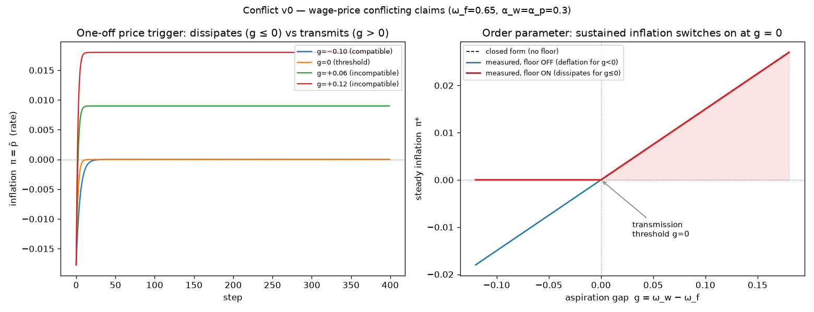
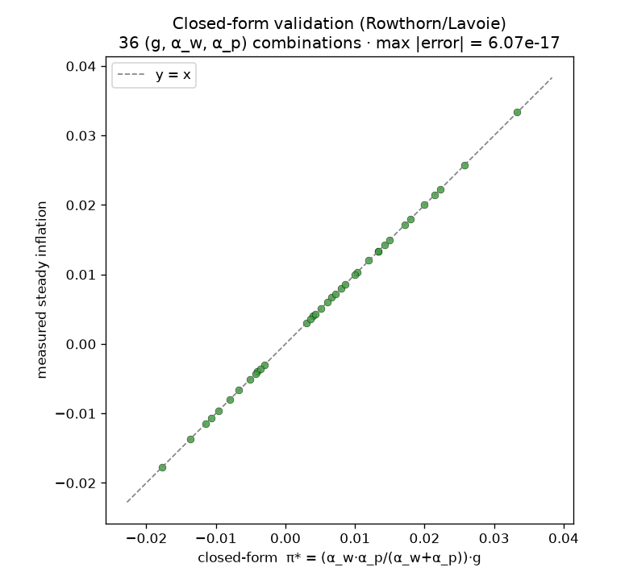
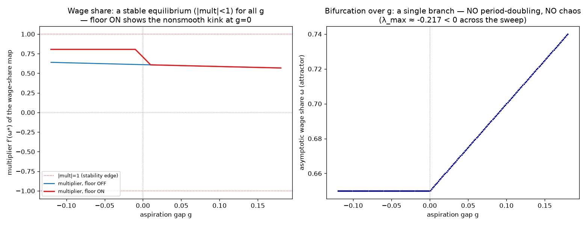

# Conflict — v0 (standalone)

CYB-1/2 isolated the **recursion** channel — technical, input–output propagation: a
3-tier chain that *amplifies* (CYB-1), then, with a behavioural ordering bias,
routes to *deterministic chaos* (CYB-2). This module isolates the other
*transmission* channel, **conflict**: inflation as a **distributional struggle**.
Workers and firms each claim a share of one conserved pie; when their claims are
incompatible — they sum to more than the whole — the unresolvable fight over a
conserved total is released as ongoing inflation. This is where **distribution
becomes a cause** of inflation, not merely the outcome the egg model measured.

Standalone (shares no code with the egg engine or the supply chain on purpose), but
it **reuses the CYB-2 instrument suite unchanged** (`../chaos/lyapunov.py`,
`linearize.py`, `bifurcation.py`) — the first cross-module reuse, which is the whole
point of having built them model-agnostic.

```bash
cd src/conflict
python3 run_v0.py        # threshold + closed-form match + dynamics + figures
```

## The minimal substrate (state + rules)

One sector, one good. Per unit of value added (normalised to the price `P`), the
wage bill is `W` and profit is the residual `P − W`. Two classes adjust their claims
backward-looking, each step:

```
ω   = W / P                       # realised wage share (= real wage in this unit)
ŵ   = max(0, α_w·(ω_w − ω))       # workers push W up when ω is below their target ω_w
p̂   = α_p·(ω − ω_f)               # firms push P up when ω exceeds their markup target ω_f
W  ← W·(1 + dt·ŵ);   P ← P·(1 + dt·p̂);   π = p̂
```

* `ω_w` — workers' target wage share. `ω_f = 1/(1+m)` — the share implied by firms'
  target markup `m`.
* **Control parameter — the aspiration gap `g = ω_w − ω_f`.** `g > 0` ⇒ incompatible
  claims (targets overdraw the pie).
* The `max(0, ·)` is a **nominal-wage floor** (wages are downward-rigid) — a
  deliberate piecewise-smooth kink, and a finding (below).

## The conserved substrate — wage share + profit share = 1, always

Profit is the **residual claimant** on one conserved unit of value added:

```
wage_share   ω = W/P            profit_share = (P − W)/P = 1 − ω
wage_share + profit_share = 1   exactly, every step, even mid-spiral
```

Targets may sum to more than one (`ω_w + (1−ω_f) > 1` when `g > 0`); **realised
shares never can**. Inflation is the release valve for claims that overdraw a
conserved pie. The conservation assert verifies the partition holds to a
scale-relative `< 1e-9` (measured residual **0.0** — it is the SFC closure, and the
assert guards it against any future edit). This is the same discipline as CYB-1's
goods residual and CYB-2's, and the conserved quantity is again load-bearing
(cf. CYB-4).

## The result

`ω_f = 0.65` (markup `m ≈ 0.538`), `α_w = α_p = 0.30`, `dt = 1`, one-off price
trigger `+10%`.

### 1. Transmission threshold (the headline)

A one-off price trigger (the egg/HPAI cost-shock analog) either dies or ignites,
depending only on the aspiration gap:

| gap `g` | claims | one-off trigger → | steady inflation `π*` |
|--------:|--------|-------------------|----------------------:|
| `−0.10` | compatible   | **dissipates** | `0.000` |
| `0`     | borderline   | dissipates     | `0.000` |
| `+0.06` | incompatible | **transmits**  | `+0.009` |
| `+0.10` | incompatible | transmits      | `+0.015` |
| `+0.12` | incompatible | transmits      | `+0.018` |

**`g = 0` is the dissipation→transmission border.** *A trigger becomes inflation
only if it is transmitted; conflict is the transmitter.* The realised wage share
settles strictly **between** `ω_w` and `ω_f` — neither side gets its claim, and the
gap is paid as perpetual inflation.

### 2. Steady rate = the conflicting-claims closed form (to machine precision)

The incompatible-regime steady inflation matches the Rowthorn (1977) / Lavoie
closed form

```
π* = (α_w·α_p / (α_w + α_p))·g
```

across **36** `(g, α_w, α_p)` combinations, **max |measured − closed form| =
6e-17**. (Derivation: `ω̇ = 0 ⇒ ω* = (α_w·ω_w + α_p·ω_f)/(α_w+α_p)`, then
`π* = α_p·(ω*−ω_f)`.) This is the conflict layer's Chen-et-al.: an independent
analytic target the simulation reproduces exactly.

### 3. What the dynamics actually are (measured, not assumed)

Run through the reused instruments, the verdict is **the opposite of CYB-2**:

* `linearize` — the multiplier of the wage-share map at the equilibrium stays in
  `[0.57, 0.81]` for all `g`: a **stable node**, monotone approach. It never
  approaches `|mult| = 1` — no smooth bifurcation.
* `bifurcation` over `g` — a **single branch**. No period-doubling, no smear.
* `lyapunov` — `λ < 0` everywhere (`≈ −0.22` to `−0.54`).

So the **real wage share is a clean stable equilibrium**; the instability lives
entirely in the **nominal price level** — a ray of sustained inflation, `P` growing
at the constant rate `π*` while `ω` sits still. Recursion (CYB-2) makes the *real*
quantities chaotic and bounded; conflict makes the *nominal* level unstable and the
real quantity calm. Two transmission channels, two opposite dynamical signatures.

### The nominal-wage floor is load-bearing (a piecewise-smooth finding)

With the floor **OFF**, the rule is symmetric and `g < 0` produces steady
**deflation** (the mirror of `g > 0` inflation) — the closed form is signed. The
spec's criterion 1 ("`g ≤ 0` dissipates") is delivered specifically by the
**nominal-wage floor**: when claims are compatible the floor binds, wages stop
falling at `ω_f`, and inflation dissipates to **exactly 0** instead of going
negative; when claims are incompatible the floor is slack and never binds, so `g > 0`
is unchanged. The floor therefore *creates* the `g = 0` threshold as a genuine
**nonsmooth border** (a kink in the multiplier at `g = 0`, visible in the dynamics
figure) — in the same spirit as CYB-2's order-non-negativity border. A clamp that
looks like hygiene is, again, the structural feature.





## Why it's real and not a bug (the validations)

1. **Closed-form match** to `6e-17` across 36 parameter combinations — the steady
   rate is the analytic conflicting-claims result, not a fitted number.
2. **Conserved shares** — wage + profit share = 1 to `0.0` every step, including
   mid-spiral. The distribution is a partition of a conserved unit; nothing leaks.
3. **Determinism** — the map is a pure function of state (no rng); identical initial
   condition → byte-identical trajectory.

## Empirical anchor (for the later grounding ticket — noted, not built)

The conflicting-claims / wage-price-spiral tradition: **Rowthorn (1977)**,
*Conflict, inflation and money*, Cambridge J. Econ. 1(3):215–239; **Lavoie**,
*Post-Keynesian Economics: New Foundations* (the canonical textbook treatment). The
2021–23 revival — "sellers' inflation" and unit-profit-vs-unit-labor-cost
decompositions: **Weber & Wasner (2023)**, *Sellers' inflation, profits and
conflict*, Rev. Keynesian Econ.; **ECB/IMF** unit-profit decompositions. As with
CYB-3, every figure gets source-verified when the grounding ticket is built; here we
only register the anchor.

## Scope (v0 deliberately excludes)

* **ISOLATED module — NOT integrated with the supply chain.** Recursion × conflict
  coupling is a later ticket (the two transmission channels interacting).
* **Backward-looking claim adjustment IN; forward-looking expectations / indexation
  OUT** — that is *reflexivity*, a sustaining channel, deferred (parallel to
  bullwhip's estimation-in / anticipation-out).
* **No money / credit** — that is *accommodation*, the other sustaining channel,
  deferred.
* **Constant targets** (`ω_w`, `ω_f` fixed) — endogenous bargaining power later.
* One good, one sector. Generalize on contact, not on spec.

## Files

- `model.py` — workers + firms, the claim-adjustment rules, the conserved-shares
  assert, the one-off trigger, the optional nominal-wage floor, and the pure 1-D
  wage-share map (`omega_map` / `omega_step_vector`) the instruments read.
- `run_v0.py` — instrument self-test → determinism/conservation → transmission
  threshold → closed-form validation → dynamics characterization → figures.
- `figures/` — transmission threshold; closed-form identity scatter; dynamics
  (multiplier + bifurcation).
