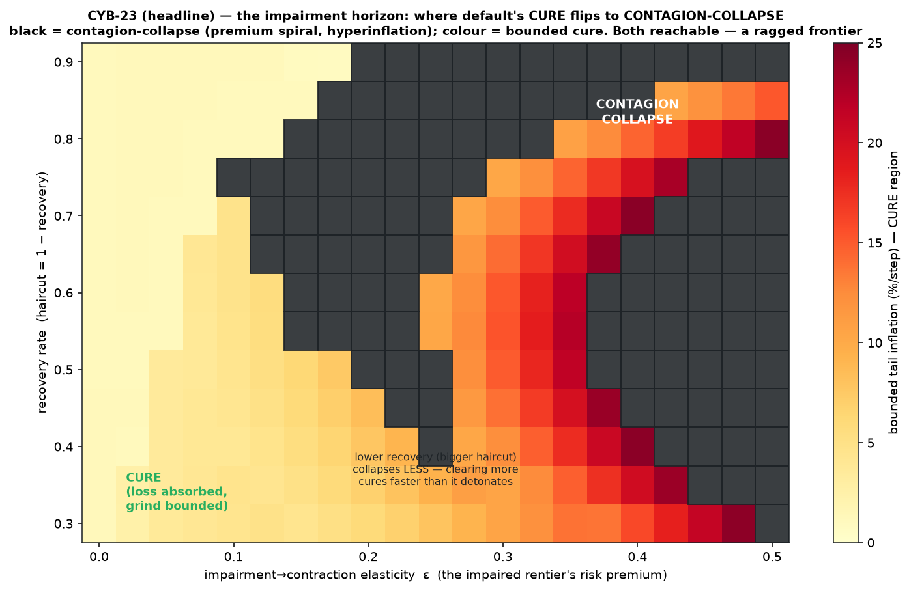
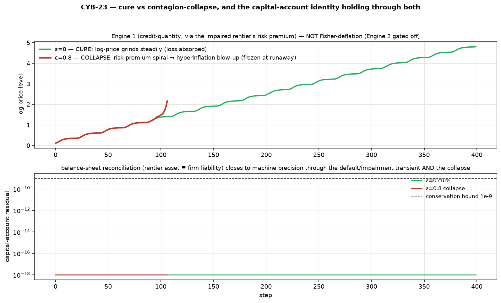
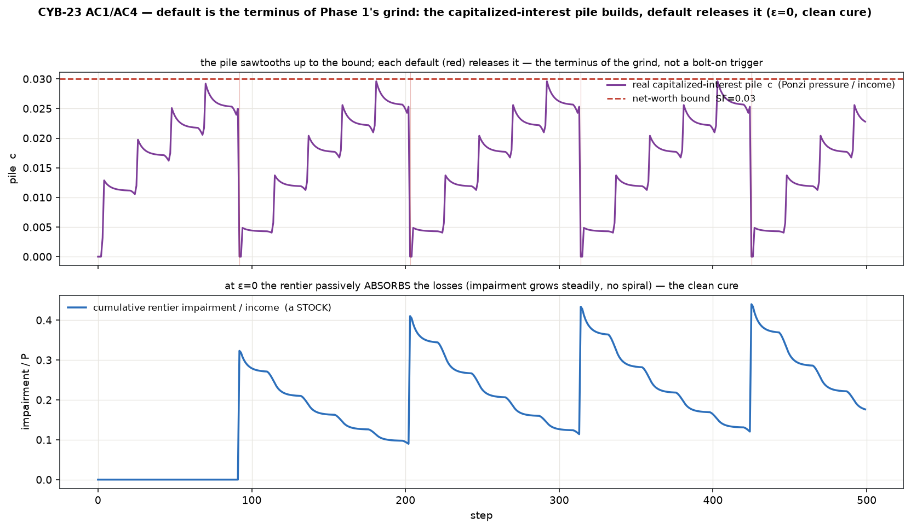

# CYB-19 Phase 2 — default + an impairable rentier pool: the impairment horizon (CYB-23)

Phase 1 (CYB-19) found the credit-crunch **bounds without curing** — a grinding limit cycle
whose Ponzi units survive by capitalizing uncovered interest onto `D`. That pile can't grow
forever. **Phase 2 lets it terminate in default, and makes the rentier pool impairable** (it
stops being a passive loss-absorber). This is the one genuine structural extension of CYB-17's
balance sheet — and the SFC payoff of the whole Minsky thread.

Standalone; **reuses CYB-19 Phase 1 (`crunch/`) unchanged**, which itself wraps CYB-17
(`accommodation/`). `recovery=1` ⇒ byte-exact Phase 1.

```bash
cd src/contagion
python3 run_v0.py   # nested regression → pile/default → impairment-horizon map → balance sheet → Fisher gate
```

## The reframe — default is simultaneously the cure and the contagion vector

Default **cures the borrower** (clears the debt that was feeding the cost channel, resets the
grind) but **impairs the lender** (a capital loss). Whether it heals or detonates is set entirely
by whether the impaired lender feeds back — which we do **not** pre-decide. We **sweep** it.

## The headline — the impairment horizon (cure ↔ contagion-collapse), and it's a *contest*

Sweeping the **impairment→contraction elasticity `ε`** (the impaired rentier prices a risk
premium on the rate, `i_eff = i + ε·impairment/P` — Engine 1, credit-quantity) against the
**recovery rate**:



* **`ε = 0` (passive loss-absorber): CURE.** Default is absorbed, the grind stays bounded
  (~1.2%/step), the rentier's impairment grows steadily with no spiral.
* **`ε` high: CONTAGION-COLLAPSE.** The risk premium spirals — dearer credit → more units tip
  Ponzi → more default → more impairment → higher premium → hyperinflationary blow-up.

**Both reachable ⇒ not rigged.** But the frontier is **ragged**, and for a real reason: two
feedbacks compete —

* **contagion** (positive): impairment → premium → more Ponzi → more default → more impairment;
* **self-cure** (negative): higher inflation → `P` ↑ → `impairment/P` ↓ → *lower* premium
  (inflation erodes the real impairment before it can detonate).

So the impairment horizon is a **contested boundary**, not a clean line.

**The counterintuitive result:** **lower recovery (a *bigger* haircut) collapses LESS** (collapse
fraction: `recovery=0.30` → 5%, `recovery=0.90` → 62%). Clearing more debt per default cures
faster than the extra impairment detonates; a **stingy** haircut that barely clears keeps the
borrower defaulting until the premium spiral ignites. Bankruptcy that *hurts the lender more per
event* can be *more stabilizing* — because it fixes the borrower.



## ⚠ Honesty caveat — this collapse is NOT Fisher-deflation

The wired mechanism is **Engine 1 (credit-quantity contagion)** — the impaired rentier's risk
premium. It produces a **hyper-INFLATIONARY** collapse. The **price-level Fisher loop (Engine 2)**
— activity collapse → `P` falls → real debt burden rises — is **GATED OFF**. A contagion-collapse
here must not be mislabeled "debt-deflation": they are opposite in sign (premium-inflation vs
price-deflation) and driven by different engines. Keeping them separate is the whole point.

### The Fisher gate + the demand-channel verification (AC6)

Engine 2 is wired as a switch, defaulted **off**. Its prerequisite — *does CYB-17's demand
channel push `P` down hard enough for Fisher to bite?* — is delivered as a **yes/no with
evidence**:

| demand_b | min tail π |
|---:|---:|
| 0 | +1.81 %/step |
| 3 | +1.27 %/step |
| 10 | −0.00 %/step |

**Verdict: NO.** CYB-17's demand channel damps inflation toward **0** but never **negative** — it
disinflates, it does not deflate. ⇒ **Engine 2 needs a *strengthened* price mechanism (Phase 2b),
not a simple switch-on.** (The gated switch itself *is* wired — forcing it on does push `P` down.)

## Default is the terminus of Phase 1's grind (AC1) — and the cure is clean absorption (AC4)

The real capitalized-interest pile `c` (Ponzi pressure / income) sawtooths up to the net-worth
bound; each default releases it. Not a bolt-on trigger — the terminus of the grind Phase 1
already exhibited. At `ε=0` the rentier passively absorbs each loss (impairment jumps, then
inflation erodes it) — the clean cure.



**Honest limitation (AC4):** on this **revolving-wage-fund** substrate the write-off reverts next
period (the wage fund is re-borrowed), so cure is **clean loss-absorption that keeps the grind
bounded** — it does *not* push inflation below the grind floor. The genuinely new outcome the
horizon reveals is the **contagion collapse** at high `ε`.

## The SFC payoff — balance-sheet / capital-account reconciliation (AC3)

The write-off is a **STOCK event**, not a flow. Conservation extends from Phase 1's flow identity
to a full **capital-account reconciliation** (Godley–Lavoie: every financial asset is someone's
liability): `ΔD = borrowing − repayment − writeoffs`; rentier wealth ↓ by the write-off;
**borrower-liability-↓ ≡ lender-asset-↓**. The identity `rentier_wealth ≡ firm_debt` closes to
**< 1e-9** (worst `4e-12`) across the whole map — *including through the default/impairment
transient and through collapses*. This is the criterion that makes the SFC spine earn its keep.

## Nested regression — byte-exact at each shell (AC5)

`CYB-17 ⊂ Phase 1 ⊂ Phase 2`:

* `recovery=1` (⇒ writeoff=0, ε inert) ⇒ **Phase 1 exactly** (`W,P,D` Δ = `0.0`);
* + `crunch_enabled=False` ⇒ **CYB-17 exactly** (`0.0`).

## Scope (excludes) — and the forward-links

* **Engine 2 (Fisher) stays OFF** — gated behind the demand-channel check → **Phase 2b** (switch
  it on, or strengthen the price channel first, then the three-basin map can distinguish
  contagion-collapse from Fisher-deflation).
* **Aggregate default only** — no unit-level / network contagion topology (deferred).
* The rentier becomes **impairable** (absorbs losses, prices the premium) but does not otherwise
  optimize/spend — minimal de-passivation.
* **Bare CYB-17 substrate** — Phase-2-on-coupled (combining CYB-22's territory) is a later cell.

## Files

- `model.py` — `ContagionEconomy`: composes an unchanged `CrunchEconomy` + default (capitalized-
  interest pile → net-worth breach) + recovery-rate haircut + impairable rentier + the swept
  impairment→premium elasticity + the gated (off) Fisher switch; **balance-sheet reconciliation
  asserts live through the transient**; graceful runaway detection (freeze at blow-up).
- `run_v0.py` — nested regression → pile/default trace → impairment-horizon map (headline) →
  capital-account conservation → cure demo → Fisher gate + demand-channel verification → determinism.
- `figures/` — impairment-horizon map (headline); pile-builds-default-releases + cure absorption;
  cure-vs-collapse + balance-sheet residual.

## Anchors

Minsky (FIH; hedge/speculative/Ponzi). Keen (Goodwin–Minsky debt dynamics — closest formal
predecessor). Fisher 1933 (debt-deflation — **Engine 2, gated**, noted for continuity).
Bernanke–Gertler financial accelerator (the balance-sheet/credit channel, read through the SFC
frame). **Godley–Lavoie** SFC capital-account consistency — the new validation surface. MMT rate
view remains the *normative consumer* (CYB-16), not built here.
