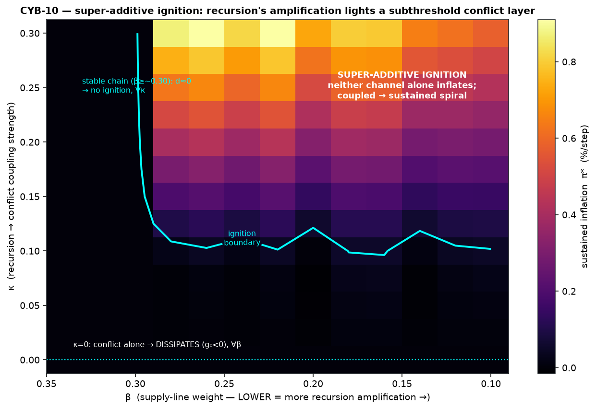
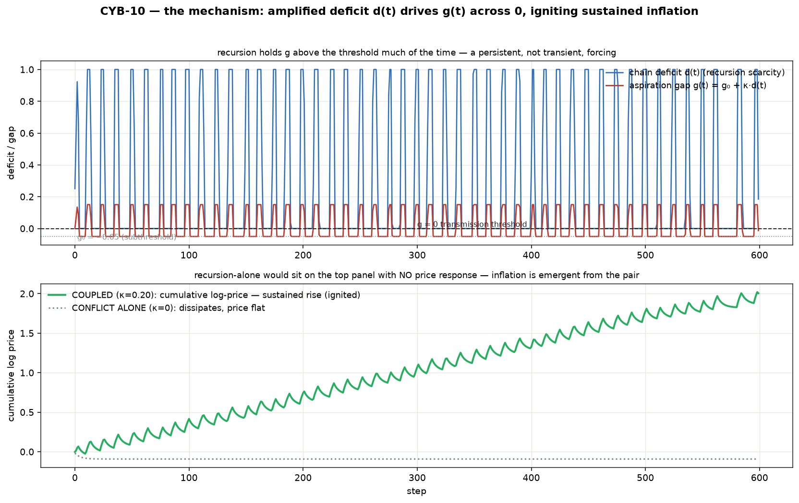
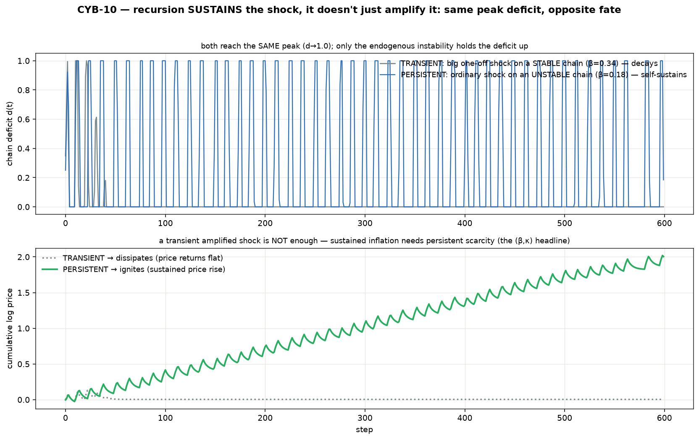
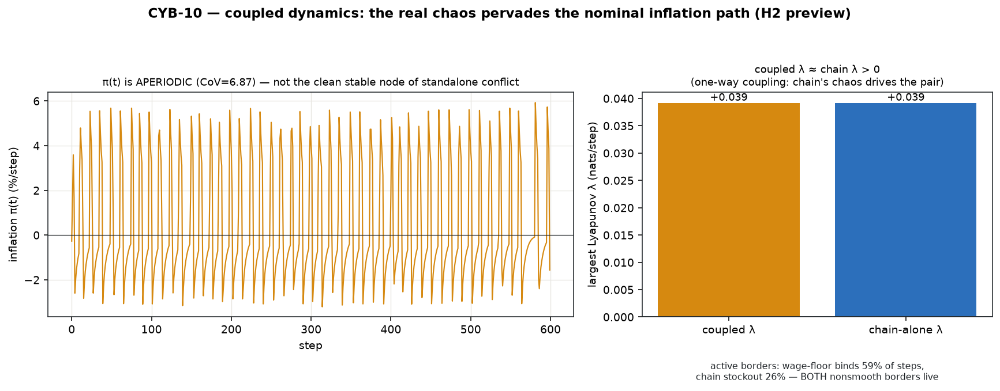

# Coupling — recursion × conflict, v0 (CYB-10)

The first integration of two isolated channels. CYB-1/2 built **recursion** (a
conserved supply chain that amplifies, then routes to deterministic chaos); CYB-6
built **conflict** (wage–price claims over a conserved pie, with a `g=0` transmission
threshold). This module couples them and asks the sharp question: **can the supply
chain's amplification ignite an inflation spiral that neither channel could light on
its own?** — the most faithful realization of the whole egg story (a cost shock,
amplified through the chain, igniting a wage–price spiral).

Standalone; **reuses both modules unchanged** plus the CYB-2 instrument suite.

```bash
cd src/coupling
python3 run_v0.py     # decoupling regression → ignition map → mechanism → transient-vs-persistent → dynamics → figures
```

## Two headline findings

1. **Super-additive ignition.** The coupled system produces a *sustained wage–price
   spiral* in a regime where **neither channel alone produces any inflation** —
   emergent from the pair, not present in either ingredient.
2. **Recursion SUSTAINS the shock; it doesn't just amplify it.** Ignition is set by
   the amplification *regime* (β), **not** the shock size — because the bullwhip
   deficit is a self-sustaining *attractor*. A transient amplified shock dissipates;
   only recursion's **endogenous** instability supplies the *persistent* scarcity that
   holds `g > 0`. This supersedes the spec-of-record's `(shock, κ)` framing with a
   measured `(β, κ)` one.

Together they give a clean mechanistic through-line for the whole taxonomy: **CYB-2's
bounded chaos IS the persistent-scarcity generator, and conflict is the machine that
converts persistent real scarcity into sustained nominal inflation.** Recursion
destabilizes the real and keeps it destabilized; conflict rectifies that persistent
real disturbance through its `g=0` threshold into an unbounded nominal spiral.

## The coupling (one-way, recursion → conflict; exactly one interaction)

Supply-chain scarcity makes firms want more margin — it **lowers their target wage
share `ω_f`**, which **raises the aspiration gap `g`**. With the chain's normalized
deficit `d(t) ∈ [0,1]` and coupling strength `κ ≥ 0`:

```
ω_f(t) = ω_f0 − κ·d(t)                    firms want more margin when scarce
g(t)   = ω_w − ω_f(t) = g0 + κ·d(t)       ω_w held fixed ⇒ the gap widens
```

So **recursion feeds straight into conflict's control parameter.** `κ=0` is fully
decoupled. `d(t)` is the fractional shortfall of the manufacturer's net stock below
its target (the upstream input-scarcity the CYB-2 chaos observable already tracks).
The conflict layer starts **subthreshold** (`g0 = −0.05 < 0`, dissipates alone); the
question is whether the chain drives `g(t)` across `0` into a **sustained** spiral.

## The result

`ω_f0 = 0.65`, `α_w = α_p = 0.30`, `g0 = −0.05` (subthreshold); chain `a_S=0.7, L=3,
θ=0.25`, control `β` (supply-line weight — lower = more amplification).

### 1. Super-additive ignition (the headline)

Mapping sustained inflation `π*` over `(β, κ)` with the conflict layer subthreshold:

| baseline | outcome |
|----------|---------|
| **conflict alone** (`κ=0`, any β) | `π* ≈ 0` — **dissipates** (subthreshold, wage floor) |
| **recursion alone** (chain, no conflict) | amplifies, **no inflation** (no nominal channel) |
| **stable chain** (`β ≳ 0.30`, any κ) | `d≈0` — **no ignition** |
| **coupled** (`β ≲ 0.30`, `κ ≳ 0.10`) | **sustained spiral**, `π*` up to `0.9 %/step` |

**The coupled system ignites in a region where *neither channel alone* produces any
inflation** — the combined ignition threshold is *lower* than either's. That is
super-additivity: inflation is **emergent from the pair**, not present in either
ingredient. 

### 2. The mechanism — persistent, not transient, forcing

The chain's amplified deficit `d(t)` drives `g(t) = g0 + κ·d(t)` **repeatedly across
0**; each excursion above the threshold pumps the wage–price spiral, and the
cumulative price climbs. Conflict alone (`κ=0`) sits flat.


**Ignition is set by the amplification *regime* (β), not by the shock size** (the
second headline). Across a 20× range of initial shock the sustained rate barely moves
(`≈0.33–0.38 %/step`), because the bullwhip deficit is a self-sustaining *attractor*.
The cleanest proof is the **matched-peak contrast**: a big one-off shock on a *stable*
chain and an ordinary shock on an *unstable* chain both reach the same peak deficit
(`d→1.0`), but the transient one **decays and dissipates** while the endogenous one
**self-sustains and ignites**. So recursion doesn't just amplify the trigger — it
**sustains** it; a transient amplified shock is not enough. (This is why the ignition
axis is `(β, κ)`, a measured refinement that **supersedes** the spec's `(shock, κ)`.)


### 3. Dynamics — the real chaos pervades the nominal path (an H2 preview)

Run through the reused instruments:
* **coupled largest Lyapunov `λ = +0.039` = the chain-alone `λ`** — the recursion
  chaos is fully present (one-way coupling: the autonomous chain drives the pair).
* **`π(t)` is aperiodic** (CoV ≈ 6.9) — the nominal inflation path *inherits* the
  chain's chaos. This is the opposite of standalone conflict's clean stable node, and
  a preview of **H2** (chaos-leakage): the answer is **yes, real chaos leaks into the
  nominal path** — because the coupling drives `g` by the chaotic `d`. The *mean* rate
  is a sustained positive `π*`, but ridden on chaotic fluctuations of both signs.
* **Both nonsmooth borders are live at once** — the wage floor binds ~59% of steps
  (conflict) and the chain stocks out ~26% (recursion). The through-line holds: real
  economic constraints are the switching manifolds (cf. CYB-2/4/6).
  

## Why it's real and not a composition artifact (the validations)

1. **Decoupling regression (`κ=0`) is byte-identical.** At `κ=0` the coupled model
   reproduces CYB-2 (chain subspace) and CYB-6 (conflict subspace) to `0.0` — the
   composition added *nothing* but the coupling. This is the load-bearing anchor
   (there is no closed form for the interaction, so the two decoupling limits are the
   ground truth).
2. **Both conserved substrates hold simultaneously.** Goods conservation (recursion)
   AND wage+profit share = 1 (conflict) stay `< 2e-15` throughout — *including* in the
   ignited/chaotic coupled regime. Two conservation laws holding at once while the
   coupled instability runs is the sanity spine.
3. **Determinism.** σ=0, pure functions of state; byte-identical reruns.

## Scope (v0 deliberately excludes) — and the follow-ups

* **One-way coupling only** (`recursion → conflict`). Bidirectional
  (`inflation → nominal ordering`) is a follow-up ticket.
* **Exactly one interaction** (`d → ω_f → g`). Nothing else couples.
* **H2 (chaos-leakage)** — the *binary* is already answered here: yes, real chaos
  leaks into the nominal path (π(t) aperiodic; conflict's stable node does NOT filter
  it out). So the follow-up ticket is to **characterize** the leakage (spectra; is
  there *partial* filtering — does the nominal path damp any frequency band?), not to
  ask whether it happens.
* Deterministic; **reflexivity** (expectations) and **accommodation** (money/credit)
  stay OUT — still a transmission-channels model. Accommodation is what would *bound*
  the nominal runaway (cf. CYB-6).

## Files

- `model.py` — `CoupledEconomy`: composes the chaos chain + conflict layer via the
  one-way `d → ω_f → g` coupling; both conservation asserts live; exposes the reduced
  coupled state (`get_state`/`step_vector`) to the instruments.
- `run_v0.py` — decoupling regression → ignition map → mechanism → shock-independence
  → dynamics (Lyapunov + borders) → figures.
- `figures/` — the super-additive ignition map (headline); the `d → g → price`
  mechanism; the coupled-dynamics characterization.

## Anchors

Recursion: Sterman (1989); Mosekilde & Larsen (1988). Conflict: Rowthorn (1977);
Lavoie; Weber & Wasner (2023). The egg model is the empirical bridge for the trigger
(a real supply shock → deficit → …).
