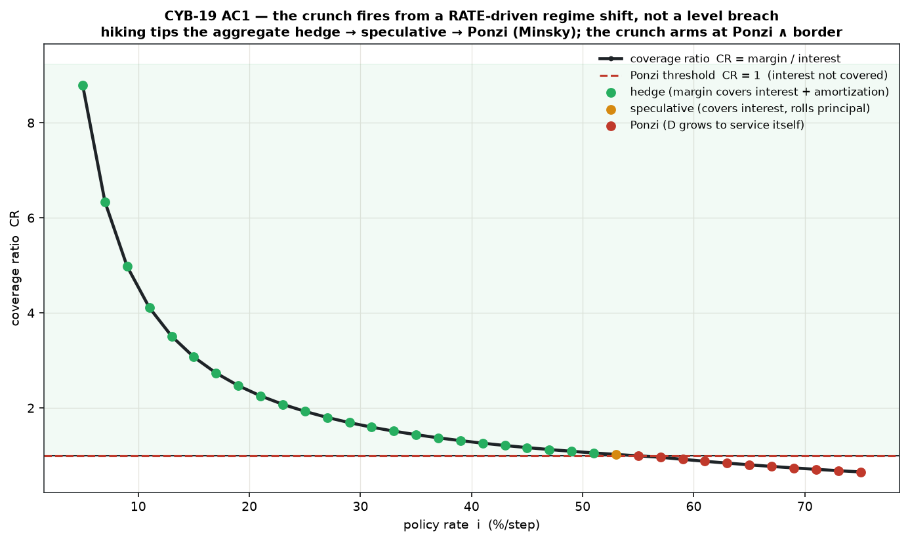
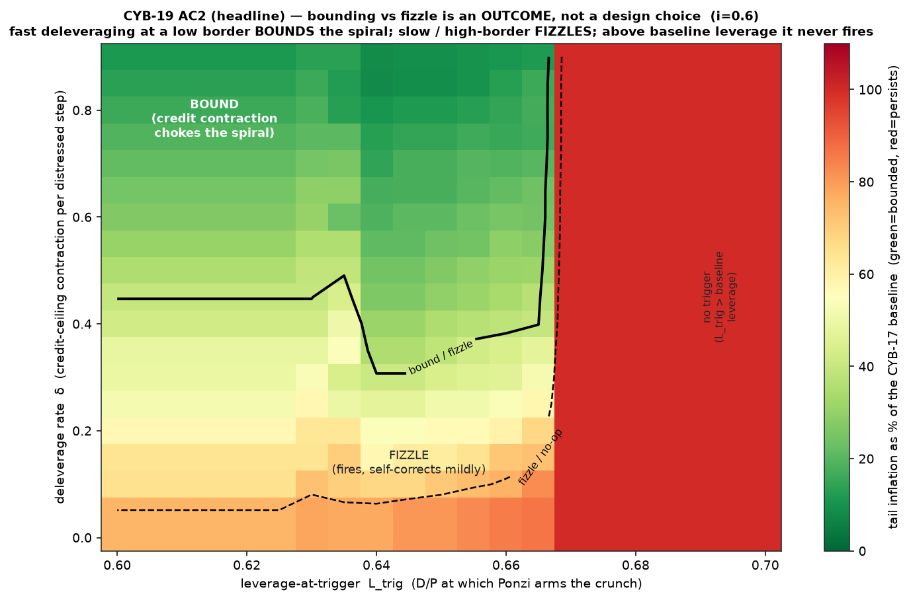
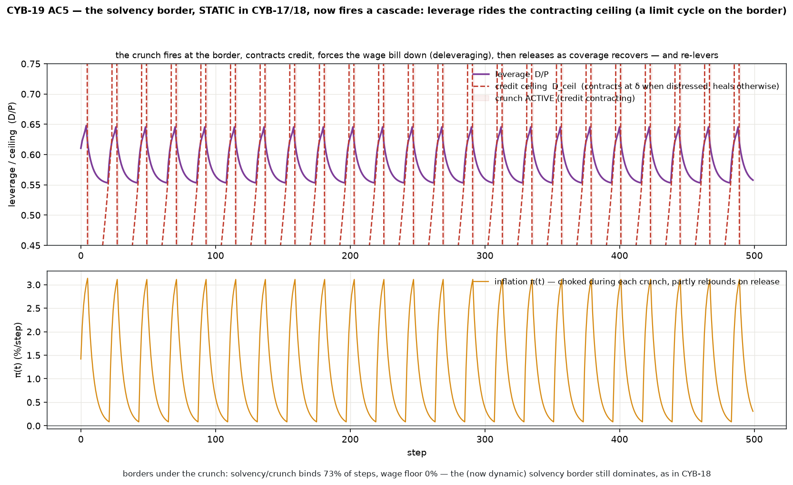

# Minsky credit-crunch cascade — Phase 1 (dynamic deleveraging off the solvency border, CYB-19)

CYB-17 built the accommodation channel and a **static** solvency ceiling `D/P ≤ D_max` that
rations credit at the border. CYB-18 showed the coupled system *rides* that ceiling (73% of
steps) and no rate zeroes inflation — debt climbs against the border in the ordinary course.
This module **fires the border**: it turns the static clamp into a dynamic **credit-crunch
cascade** and lets the outcome — does the crunch *bound* the spiral or merely *fizzle* — fall
out of the parameters. **"The big one," Phase 1.**

Standalone; **reuses CYB-17 (`accommodation/`) unchanged** — it only classifies the financing
regime from CYB-17's existing flows and drives its solvency ceiling dynamically.

```bash
cd src/crunch
python3 run_v0.py   # regression → regime tipping → bounding/fizzle map → border dynamics
```

## ⚠ Phase-1 honesty guard (read first)

The **Fisher debt-deflation** basin (falling `P·Y` raises the real debt burden ⇒ *more*
deleveraging ⇒ "the more they pay, the more they owe") is **deliberately UNWIRED here**. Phase
1 contracts *new* credit and forces repayment; it does **not** default, impair, or write off
(the rentier pool stays passive). So this build maps **bounding vs fizzle only** — it may
**NOT** be read as "the crunch is stabilizing." Default + an impairable rentier pool closes the
Fisher loop and completes the three-basin map — that is **Phase 2 (CYB-19 Phase 2)**, its own
ticket. Wiring only the bounding path would be a financial-stability pamphlet; the discipline
is to state it in isolation and point at Phase 2 for the full distribution.

## The one new mechanism (everything else is CYB-17, recovered byte-exact)

A **financing-regime classifier** + a **deleveraging-rate cascade**.

### Trigger — a regime shift, not a level breach (Minsky, from existing CYB-17 flows)

Per period, with `margin = P − W` and `interest = i·D`, classify the aggregate:

| regime | condition | meaning |
|---|---|---|
| **hedge** | `margin ≥ interest + am·D` | covers interest **and** amortizes principal |
| **speculative** | `interest ≤ margin < interest + am·D` | covers interest, must **roll** principal |
| **Ponzi** | `margin < interest` | can't cover interest ⇒ `D` **grows to service itself** |

Ponzi is *exactly* CYB-17's `capitalized = max(0, interest − margin) > 0` — the model already
knew how to go Ponzi; we just named it. The crunch **arms when the aggregate tips into Ponzi
*and* leverage has reached the solvency border** (`D/P ≥ L_trig`): accommodation stops
accommodating. It is a **rate-driven** shift — hiking tips hedge → speculative → Ponzi (the
coverage ratio `CR = margin/interest` falls through 1):



A *finding in itself*: on this substrate the financing regime is set by the **policy rate** —
leverage-at-trigger is not a free lever, the rate delivers you to Ponzi (echoing CYB-17/18,
where the rate is the load-bearing conditioning variable).

### Cascade — a deleveraging *rate*, not an instantaneous snap

On firing, the credit ceiling **contracts at rate `δ`** each distressed step
(`D_ceil ← min(D_ceil, D/P)·(1−δ)`); CYB-17's own solvency clamp then freezes the wage bill
against the descending ceiling (W held while P rises ⇒ `ω` and `D/P` fall) — **forced
deleveraging**, the bounding path. When coverage recovers to hedge, credit **heals** back at
rate `heal`. The outcome is a **race** between the two rates.

## The headline — bounding vs fizzle is an OUTCOME, not a design choice

Over **(leverage-at-trigger `L_trig`, deleverage rate `δ`)** at `i = 0.60` (CYB-17 baseline
`π* = +3.30 %/step`):

| corner | π* | vs baseline |
|---|---:|---:|
| **fizzle** (`L_trig=0.66, δ=0.05`) | +2.82 %/step | 85% — crunch fires, self-corrects mildly |
| **bound** (`L_trig=0.61, δ=0.90`) | +0.38 %/step | 12% — credit contraction chokes the spiral |
| no-op (`L_trig ≳ 0.69`) | +3.30 %/step | 100% — above baseline leverage, never fires |



**Fast deleveraging at a low border bounds the spiral; slow / high-border fizzles; above the
rate-set baseline leverage the crunch never fires.** Both bound and fizzle are reachable — a
crunch that *always* bounds would be as rigged as one that always collapses. The boundary is
diagonal: you need to fire *early* (low `L_trig`) **and** contract *fast* (high `δ`) to bound.
And even a hard bound only cuts inflation to ~12% via a **grinding limit cycle at the border**,
never cleanly to zero — the crunch bounds but does not *cure* (and the genuinely dangerous
basin, debt-deflation, is the unwired Phase-2 direction).

## Border dynamics — the solvency border, static in CYB-17/18, now fires a cascade

The solvency ceiling that merely *clamped* in CYB-17/18 now **recurs as a limit cycle**:
leverage rides the contracting ceiling down, coverage recovers, credit heals, the spiral
re-levers, and it fires again.



Two borders are live on this bare-CYB-17 substrate (the recursion/stockout border is
coupled-only, CYB-18): the **solvency/crunch border binds 73% of steps, the wage floor 0%**
(the spiral is suprathreshold — claims stay incompatible, the floor never binds). The solvency
border still **dominates**, as in CYB-18 — but it is now *dynamic*: a border that fires, not
just clamps.

## Why it's real and not an artifact

1. **Regression anchor byte-exact.** Crunch-off (trigger disabled) reproduces CYB-17 (`W,P,D`)
   to **`0.0`** — the classifier + cascade are provably the only new thing.
2. **Conservation through the deleveraging transient.** The three-way income identity
   `wage + interest + retained = 1` and the debt bookkeeping `ΔD = borrowing − repayment` hold
   to `≤ 1e-16` *including* mid-crunch — contracting credit leaks no accounting. (Write-offs are
   Phase 2; Phase 1 contracts *new* credit and forces repayment, no impairment.)
3. **Determinism.** σ=0, pure function of state; byte-identical reruns.

## Scope (Phase 1 excludes) — and the forward-links

* **No default / no write-offs / passive rentier pool** ⇒ the debt-deflation basin is
  unreachable **by construction**. → **Phase 2 (CYB-19 Phase 2)**: default + impairable rentier
  pool closes the Fisher loop and completes the *fizzle / bound / debt-deflate* three-basin map.
* **Bare CYB-17 substrate only** — the crunch on the coupled egg stack (where CYB-18 showed it's
  central) is the **CYB-19-on-coupled** follow-up.
* One new mechanism = trigger + deleveraging-rate cascade; CYB-17's demand channel is reused for
  activity effects (no new price mechanism).
* Related: **CYB-21** — supply-chain / inventory financing (the rate's fourth channel).

## Files

- `model.py` — `CrunchEconomy`: composes an unchanged `AccommodationEconomy` + the Minsky
  regime classifier (hedge/speculative/Ponzi) + the deleveraging-rate cascade fired at
  Ponzi∧border; conservation asserts live through the transient. `crunch_enabled=False` ⇒ pure
  CYB-17.
- `run_v0.py` — regression → regime tipping (AC1) → bounding/fizzle outcome map (AC2, headline)
  → border dynamics (AC5) → conservation + determinism.
- `figures/` — regime tipping; bounding-vs-fizzle map (headline); border-dynamics limit cycle.

## Anchors

Minsky (financial instability hypothesis; hedge/speculative/Ponzi). Keen (dynamic
Goodwin–Minsky — the closest formal predecessor). Fisher 1933 (debt-deflation — the **Phase 2**
mechanism, noted for continuity). Endogenous money / horizontalism (Moore; Lavoie); the SFC
balance-sheet interlock is the spine — and is where Phase 2 earns its keep. Mosekilde (project
anchor).
