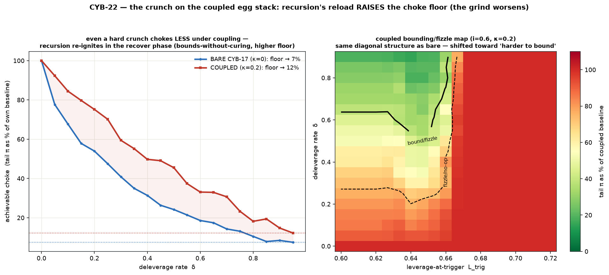
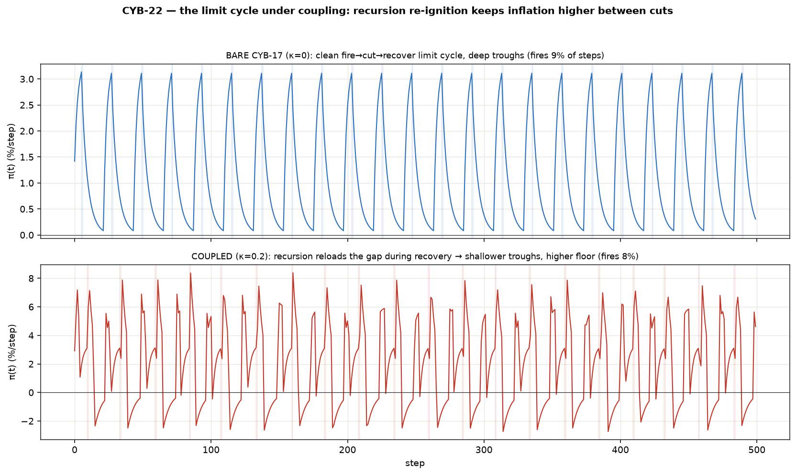
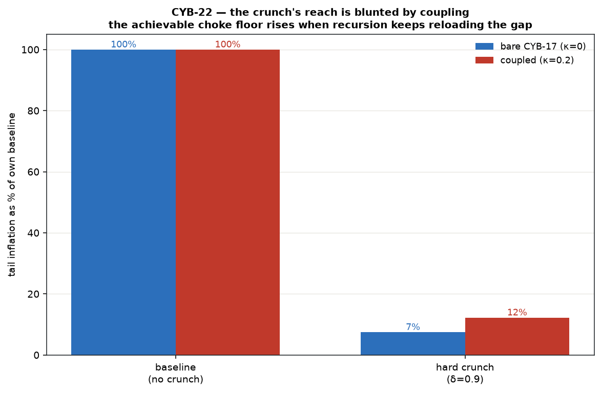

# Credit-crunch on the coupled substrate — v0 (CYB-19 Phase 1 crunch on the CYB-18 egg stack, CYB-22)

CYB-19 Phase 1 built the Minsky credit-crunch cascade on **bare CYB-17** and found it
**bounds without curing**: it converts a runaway into a grinding limit cycle that only chokes
to ~12% (fire→cut→recover→re-lever). This module drops that **same crunch, unchanged**, onto
CYB-18's **coupled** recursion×conflict+financing substrate — the faithful egg stack, where
recursion reloads the aspiration gap every period (`g(t)=g0+κ·d(t)`) and no rate zeroes
inflation. **Pure inheritance — no new mechanism.**

Standalone; **reuses CYB-18 (`accommodation_coupled/`), CYB-19 Phase 1 (`crunch/`) and the
`chaos/` chain unchanged** — it only reads the chain deficit and reloads the crunch's inner
accommodation base gap.

```bash
cd src/crunch_coupled
python3 run_v0.py   # two anchors → choke-under-coupling (headline) → limit cycle → borders
```

## The one inherited interaction

CYB-19's `CrunchEconomy` already wraps an `AccommodationEconomy` and drives its solvency ceiling
`D_max` dynamically. CYB-18 drives that same accommodation layer's *base gap* from the chain
deficit. So we hold a `ChaosChain` + a `CrunchEconomy` and, each step, reload the crunch's inner
accommodation base by `κ·d` (the CYB-18 coupling) before running the unchanged crunch tick.
**Recursion reloads the gap; the crunch fires against the border.**

## The headline — the grind gets WORSE under reloading

Phase 1's crunch bounds-without-curing. On the coupled substrate it bounds **even less**:

| (i=0.60, L_trig=0.64) | bare CYB-17 (κ=0) | coupled (κ=0.20) |
|---|---:|---:|
| baseline spiral (no crunch) | +3.30 %/step | **+4.09 %/step** (recursion reloads ⇒ hotter) |
| best achievable choke (min over δ) | 7% of baseline | **12%** of baseline |
| limit-cycle amplitude (tail σ of π) | 1.02 %/step | **2.93 %/step** |



**Recursion re-ignites the spiral in the crunch's recover phase, before the next cut can land.**
So the achievable choke floor **rises** (7% → 12%), the crunch is *uniformly* less effective at
every deleverage rate `δ`, and the bounding/fizzle boundary shifts toward "harder to bound." The
crunch still can't cure on bare CYB-17; on the egg stack it bounds even less.

The limit cycle tells the same story — clean and deep-troughed when bare, chaotic and
shallow-troughed (higher floor) when coupled:





## The two regression anchors — both byte-exact

Two axes of composition (coupling × crunch), one anchor each:

* **crunch-off ⇒ CYB-18 exactly** (`W,P,D` Δ = `0.0`) — the accommodation-coupled substrate.
* **decouple (κ=0) ⇒ CYB-19 Phase 1 exactly** (`0.0`) — the crunch on bare CYB-17.

Together they prove the composition added nothing but the interaction of two already-validated
parents.

## Border dynamics

The solvency/crunch border binds **73% (bare) → 63% (coupled)** of steps — it stays **dominant**
on both (CYB-18's static ceiling also rode 73%). Coupling makes the spiral hotter *between*
binds (the chaotic reload), so each bind chokes less — hence the higher floor.

## Why it's real and not a composition artifact

1. **Both decoupling limits recover their parents exactly** (`0.0`).
2. **All conservation laws green through the crunch transient** — goods (chain) + three-way
   income + debt bookkeeping — worst residual **`1e-15`** in the coupled+crunching regime.
3. **Determinism.** σ=0, byte-identical reruns.

## Scope (v0 excludes) — and the forward-links

* **No default / no Fisher** — that is **CYB-19 Phase 2 (CYB-23)**, and it stays on the bare
  substrate until it ships. This ticket is the *bounding/fizzle* crunch on coupled, nothing more.
* Wage-bill financing only; one-way coupling only (both inherited).
* Reuse `coupling/`, `accommodation/`, `crunch/` unchanged.
* **Phase-2-on-coupled** — default/contagion on the egg stack — is the eventual full combination,
  a later cell (combines CYB-23's territory with this one's).

## Files

- `model.py` — `CrunchCoupledEconomy`: composes `ChaosChain` (unchanged) + `CrunchEconomy`
  (CYB-19 P1, unchanged, which owns the CYB-17 accommodation layer + the crunch cascade) via the
  CYB-18 reload `g=g0+κ·d`; all conservation asserts live in the reused submodules.
- `run_v0.py` — two byte-exact anchors → choke-under-coupling (headline) → limit-cycle
  amplitude/frequency → border dynamics → conservation + determinism.
- `figures/` — choke-vs-δ + coupled outcome map; limit cycle bare-vs-coupled; choke-floor summary.

## Anchors (no new literature — inherited from the parents)

Recursion: Sterman 1989; Mosekilde & Larsen 1988. Conflict/distribution: Rowthorn 1977; Lavoie.
Endogenous money / horizontalism: Moore 1988; Lavoie. Circuit theory: Graziani. Minsky (FIH;
hedge/speculative/Ponzi); Keen (dynamic Goodwin–Minsky).
