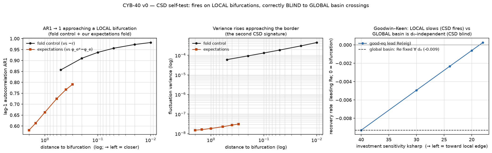

# Critical slowing down — the scale-free early-warning instrument (CYB-40)

> An instrument self-test rung, in the spirit of `src/chaos/` on the logistic map. CSD is the
> **topological, scale-free bridge to data** the project needs: *when/how, not how much.*

```bash
cd src/csd
python3 run_v0.py     # fold control → expectations fold → Goodwin–Keen local-vs-global → determinism
```

## What it is

**Critical slowing down** (Scheffer et al. 2009): as a system approaches a **local** bifurcation, the
equilibrium's recovery rate → 0, so under noise the fluctuation **variance rises** and the **lag-1
autocorrelation (AR1) → 1**. Those two signatures are *shapes, not magnitudes* — invariant under any
rescaling of the axis — so they can be looked for in a real time series **with no fit and no
unit-matching.** That is exactly the property the frozen-border empirical tests lacked (they needed a
calibration constant to place an absolute border on absolute data); CSD sidesteps it by construction.

## The scope — a real boundary, and it is the good news

CSD does **not** fire on everything, and that is what makes it trustworthy:

- **Fires** at **LOCAL** bifurcations — fold, Hopf, flip: the equilibrium itself losing stability as a
  *parameter* drifts. The slowdown is audible before the transition.
- **Blind** to **GLOBAL / basin** crossings (the equilibrium stays stable; a shock throws the system
  over a watershed) and to **abrupt knife-edges**. Nothing softens, so no early warning *exists* to
  detect — the silence is correct, not a defect.

So CSD **discriminates forecastable from unforecastable transitions** — and hands the project a
diagnostic: of any real crisis, *was it a local slow-build (CSD-detectable, you could have seen it) or
a global shock-crossing (no warning possible even in principle)?*

## Self-test (all from `run_v0.py`)

| # | benchmark | result |
|---|---|---|
| 0 | **fold normal form** (analytic control) | var 6e-5→4.5e-4, **AR1 0.857→0.982**, tracking the exact multiplier μ→1 as r→0⁻ — detector validated |
| 1 | **expectations de-anchoring fold** (our model, physical branch ω*≤1) | var and **AR1 rise (0.58→0.79)** as φ_e→ the fold, tracking |eig| 0.70→0.97 — **CSD fires on our local border** |
| 2 | **Goodwin–Keen** | **local:** good-eq recovery rate `Re→0` (−0.0093→+0.0003) as ksharp→ the stability edge ⇒ CSD would fire. **global:** that eigenvalue is a *parameter* property, **independent of the initial leverage** that decides basin survival ⇒ CSD **correctly blind** to the breakdown-basin crossing |
| 3 | determinism | fixed-seed noise ⇒ byte-identical rerun |



## Honest notes / scope

- **Noise is a fixed-seed diagnostic.** CSD is inherently a fluctuation phenomenon, so the probe adds
  a small seeded perturbation to otherwise-deterministic maps; same seed ⇒ byte-identical output (the
  σ=0 discipline holds for the underlying models). The eigenvalue *recovery rate* is the noise-free
  backbone that explains the var/AR1 rise.
- **AR1 of a projected coordinate undershoots the full eigenvalue.** The expectations system is 2-D
  (ω, π^e); AR1 of ω alone reads below the leading |eig| (0.79 vs 0.97 at φ_e=1.7). The *trend*
  (var↑, AR1↑ toward the border) — the CSD signature — is unambiguous; the absolute AR1 level is not a
  claim.
- **Physical branch only.** The expectations sweep stops at ω*≤1 (φ_e≤1.7); we do not measure CSD on
  the unphysical branch (the Goodwin–Keen gate-#2 discipline).
- **Illustration/instrument, not empirics.** This validates the *detector* on known-answer models. It
  says nothing yet about any real economy — that is the next rung.

## Why it matters — the data bridge for leg 3

This is the first **validated, model-free, no-fit, scale-free** instrument, plus a map of where it
applies:
- **CSD-bridgeable to data:** expectations de-anchoring, the Goodwin–Keen Hopf, any local NAIRU-type
  bifurcation. **First empirical target:** *does inflation show rising variance/AR1 before expectations
  de-anchor?* — a pure when/how test on real series.
- **Not CSD-bridgeable:** the Keen breakdown basin (→ needs hysteresis/bistability detection) and the
  Fisher corner (abrupt → likely no early warning at all — itself a finding).

## Files

- `model.py` — `var_ar1` (the two signatures), `noisy_series`/`csd_curve` (the diagnostic harness),
  `fold_normal_form` (the analytic control). Deterministic given a seed; a candidate for promotion into
  `src/chaos/` once it earns a second use.
- `run_v0.py` — the four self-tests + the figure; loads `../expectations/model.py`,
  `../goodwin_keen/model.py`, `../chaos/linearize.py` (read-only).
- `figures/` — AR1→1 and variance↑ (fold + expectations) and the GK local-vs-global recovery rate.

## Anchors

Scheffer et al. 2009 (*Early-warning signals for critical transitions*, Nature); Wissel 1984 (the
recovery-rate → 0 basis). Instruments: `src/chaos/linearize`. Bases: `expectations/` (CYB-20),
`goodwin_keen/` (CYB-33/35). Descriptive/illustrative only.
