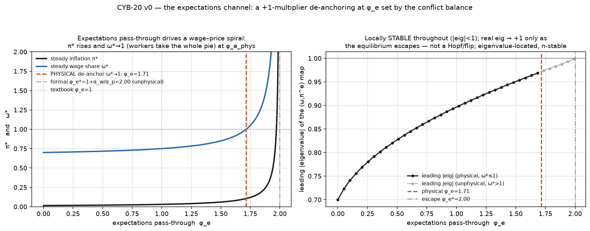

# Expectations — the second sustaining channel, and its de-anchoring border (CYB-20 v0)

> Ticket: **CYB-20**. Builds on **CYB-6** (`conflict/`) unchanged — `phi_e=0` ⇒ CYB-6 byte-exact.
> The channel *classical macro is built on*: workers demand compensation for the inflation they
> **expect**, not only for the real wage they've already lost.

```bash
cd src/expectations
python3 run_v0.py   # nesting → conservation → closed form → the bifurcation (linearize) → determinism
```

## Why this module

CYB-6 makes inflation a distributional struggle with a *backward-looking* wage rule; CYB-17 found
that distributional channel **self-exhausts**. Recursion (CYB-10/18) is one *sustaining* channel —
an inflation floor. This is the other, and the mainstream's home turf: **expectations**. The
expectations-augmented Phillips curve, the natural-rate hypothesis, and the whole forward-looking
New Keynesian edifice live here. If the project is to *engage* the standard toolkit rather than talk
past it, this is the axis to do it on.

## The one new mechanism

Everything else is CYB-6, reused. The wage claim gains an expected-inflation term:

```
ω = W/P
ŵ = α_w·(ω_w − ω) + φ_e·π^e        # + EXPECTED-inflation compensation (new)
p̂ = α_p·(ω − ω_f)                  # firms respond to the realised wage share (UNCHANGED)
W ← W(1+dt·ŵ);  P ← P(1+dt·p̂);  π = p̂
π^e ← π^e + λ·(π − π^e)             # adaptive expectations (Cagan/Friedman)
```

`φ_e` = expectations **pass-through** (the swept pivot; `φ_e=0` ⇒ CYB-6 byte-exact). `λ` = the
adaptive updating speed. The nominal-wage floor is applied to the *whole* claim, so indexation can
lift a floored claim off the kink (a deliberate, tested interaction).

## The finding — a genuine de-anchoring border, at a conflict-set threshold

**Closed form (confirmed against the sim to ~1e-16).** With ω stationary and `π^e=π`:

```
π* = α_w·g / (1 + α_w/α_p − φ_e)
```

Steady inflation rises with the pass-through and **diverges as `φ_e → 1 + α_w/α_p`** — a real
de-anchoring border. **Crucially it is NOT the textbook accelerationist `φ_e=1` (full indexation):**
the de-anchoring point is set by the **conflict balance** `α_w/α_p` (relative worker/firm adjustment
speed). `run_v0` verifies the threshold tracks that ratio (2.00, 1.50, 3.00, 1.33 for the four cases).

**The physical border is lower — and it's a distributional event.** The steady wage share
`ω* = ω_f + π*/α_p` rises with `φ_e` too, and hits **`ω*=1` (workers capture the entire pie, profit
share → 0) at `φ_e ≈ 1.71`** for the default parameters — *below* the formal `φ_e*=2.0`, which lives
on an **unphysical** branch (`ω*>1`, firms in permanent loss). So the economically meaningful
de-anchoring is **the wage share saturating at 1**, a total-worker-victory limit the pass-through
drives the spiral into.



## Located by `linearize`, not by overflow — and it corrected the scratch probe

The bifurcation is characterised by the **eigenvalues of the reduced 2-D `(ω, π^e)` map's Jacobian**
(`chaos/linearize`), not by finite-time blow-up. That distinction was load-bearing here: a scratch
probe using overflow-detection reported a "dynamic instability *below* the threshold" that drifted
with the horizon — the retired-two-basin smell. The eigenvalue analysis shows there is **no such
sub-threshold instability**: the leading `|eig|` stays **< 1 throughout the equilibrium's physical
existence** (0.70 at `φ_e=0` → 0.97 at `ω*=1`), so the equilibrium is **locally stable** the whole
way. The leading eigenvalue is **real across the entire sweep** (max |Im| < 1e-9) and its real part
**→ +1** only as the equilibrium escapes to infinity at `φ_e*` — a **+1-multiplier de-anchoring**
(the steady-π pole), **not** a Hopf (no complex pair) and **not** a flip (not −1). The probe's
"sub-threshold divergence" was a **transient/basin overshoot from a far start**, not a local
instability. Eigenvalue-located ⇒ n-stable, not a detector artifact.

## Self-tests (all from `run_v0.py`)

| # | test | result |
|---|---|---|
| 0 | nesting | `phi_e=0` ⇒ CYB-6 `ConflictEconomy` byte-exact (max\|W,P Δ\| = **0.0**) |
| 1 | conservation | wage+profit partition 1 through the spiral, worst residual = **0.0** (< 1e-9) |
| 2 | closed form | sim π* vs `α_w·g/(1+α_w/α_p−φ_e)` = **Δ ~1e-16**; threshold tracks α_w/α_p |
| 3 | bifurcation | +1-multiplier de-anchoring (leading eig real, →+1 at the pole); `|eig|<1` across the physical range; physical `φ_e≈1.71` (ω*→1) below the formal `φ_e*=2.0` (unphysical) |
| 4 | determinism | byte-identical rerun |

## Honest notes / scope

- **The physical border is ω*→1, not π*→∞.** The formal `φ_e*=1+α_w/α_p` sits on an unphysical
  branch (ω*>1). We report the wage-share-saturation border as the economically meaningful one, and
  flag the unphysical segment explicitly (the same *check-the-equilibrium's-physicality* discipline as
  the Goodwin–Keen v1 catch).
- **Not the accelerationist φ_e=1.** The conflict-balance threshold is the structurally interesting
  content; whether that is "more informative than the standard natural-rate story" is a claim to earn
  in v1, not assert here. Note the threshold `1+α_w/α_p` reflects **two** modelling choices together:
  the adjustment-speed ratio *and* the decision to put expectations only in the **wage** claim (firms
  respond to the realised ω, no expectations term in `p̂`). A symmetric (price-side) indexation would
  move it — a deliberate v0 scoping, flagged so the threshold value isn't over-read.
- **Adaptive, not rational, expectations.** A deliberate first cut (Cagan/Friedman). The result is a
  property of the *mechanism*, not a fitted expectations parameter (no tuning to any target).
- **Descriptive only** — no policy/normative content.

## Next — reflexivity (CYB-20 v1, scoped, NOT built here)

The real prize: let de-anchored `π^e` feed back and **shift the fundamentals** — the markup target
`ω_f` or the aspiration gap `g` — the two-way Soros loop rational-expectations models assume away.
That is a distinct bifurcation question (expectations altering the DGP, not just behaviour) and gets
its own cheap probe → build → reviewer gate, exactly as this v0 did.

## Files

- `model.py` — `ExpectationsParams` (nests `ConflictParams`; `phi_e`, `lam`), `ExpectationsEconomy`
  (the augmented tick + conservation), the closed-form `deanchor_threshold`/`steady_pi`/`steady_state`,
  and the reduced 2-D `map2d`/`step_vector` the instruments consume.
- `run_v0.py` — the five self-tests + the `linearize` bifurcation characterization + the figure;
  loads `../chaos/linearize.py` (read-only) and `../conflict/model.py` (for the nesting anchor).
- `figures/` — π*/ω* vs φ_e (the two borders) and the leading-|eig| curve (stable → fold).

## Anchors

Friedman–Phelps (expectations-augmented Phillips curve / natural rate). Cagan (adaptive
expectations). Lucas–Sargent (rational expectations — the frame v1's reflexivity departs from).
Soros (reflexivity). Instruments: `src/chaos/linearize.py`. Base: CYB-6 `conflict/`.
