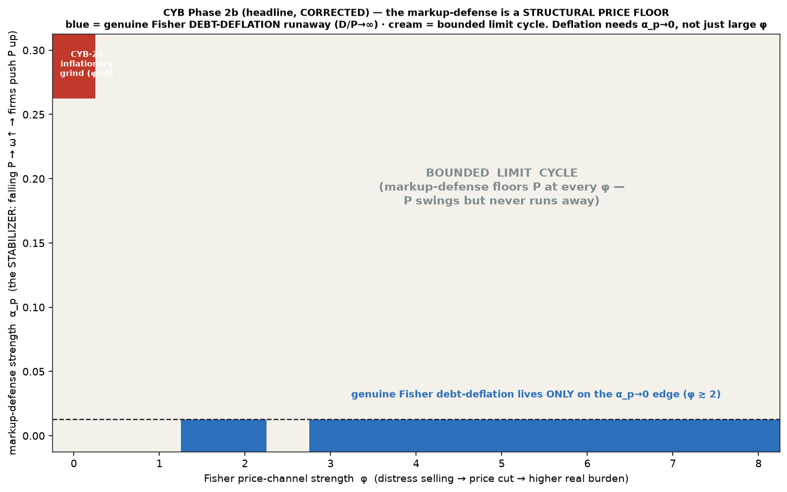
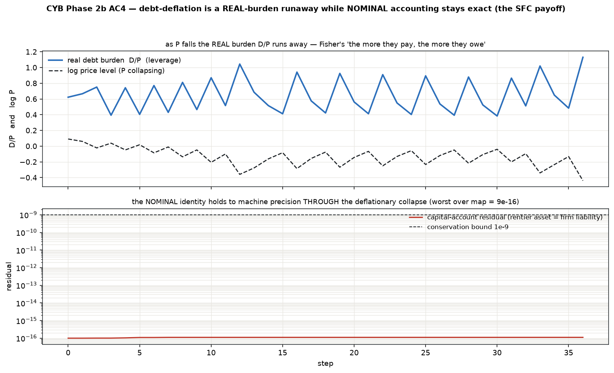
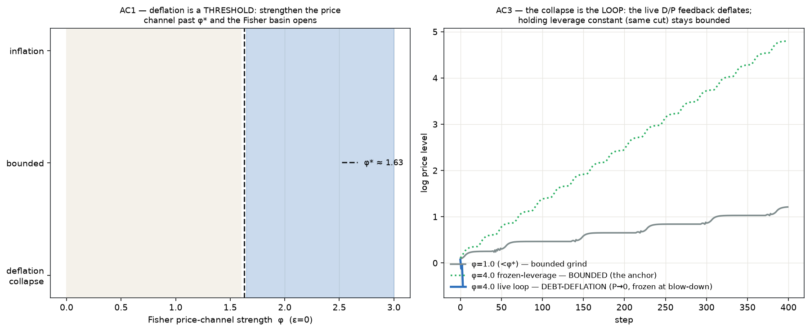

# Phase 2b — the genuine Fisher debt-deflation loop: PROVING the basin

> Ticket: **[CYB-30](https://linear.app/techno87/issue/CYB-30)** (CYB-19 Phase 2b).
> Successor to CYB-23 (Phase 2). Standalone; **reuses CYB-23 (`contagion/`) unchanged**
> (`fisher_phi=0` ⇒ byte-exact CYB-23 ⇒ Phase 1 ⇒ CYB-17).

> **⚠️ This supersedes the first-cut v0 headline (a "two-basin map" with a deflation threshold
> φ\*≈1.63). That was a DETECTOR ARTIFACT** — it froze a bounded oscillation at a down-swing and
> called it a collapse. The proper-proof pass below refutes it and replaces it with a stronger,
> honest finding. The refutation trail is kept deliberately (repo methodology: *"every version
> that shaped an input to fit an output got refuted by the next"*).

CYB-23 wired **Engine 1** (credit-quantity contagion → **hyper-INFLATIONARY** collapse) and
**gated Engine 2 (the price-level Fisher loop) OFF** — honestly: CYB-17's demand channel is a
*symmetric multiplicative damper*, so it drives inflation toward 0 **from above** and can never
flip sign. Deflation was **unreachable by construction**, and CYB-23 said *"Engine 2 needs a
strengthened price mechanism (Phase 2b), not a switch-on."* This module builds that mechanism and
asks the question CYB-23 deferred: **is "inflationary, not Fisher" conditional, or does something
structural prevent debt-deflation?**

```bash
cd src/fisher
python3 run_v0.py   # nested regression → the refutation → the (α_p,φ) map → loop anchor → conservation → resolution
```

## The one new mechanism — a genuine, self-reinforcing Fisher loop

Everything else is CYB-23, reused unchanged. The crude `fisher_on` switch stays **OFF**; Phase 2b
supersedes it with a real feedback loop keyed off the **real debt burden**:

```
pressure = max(0, leverage − b_ref)      # excess real debt burden D/P = distress
P ← P · (1 − φ · pressure)               # distress selling cuts the price level
# next period: leverage = D/P rises (D nominal, unchanged) ⇒ pressure rises ⇒ a bigger cut
```

That is Fisher 1933's *"the more they pay, the more they owe."* The pivot is `φ`; `φ=0` recovers
CYB-23 byte-for-byte.

## How to attack a debt-deflation claim — and what breaks

The skeptic's test (the one a Minsky/Keen-orbit economist would run): **lift the collapse
detectors and see whether the price level actually runs away.** It does not.

Composed on the conflict layer, the Fisher cut is a *self-limiting* feedback: a falling `P` raises
the wage share `ω = W/P`, so the next tick the conflict layer's markup-defense pushes `P` back up.
The two forces settle into a **bounded limit cycle** — the running-min `log P` is byte-identical
across the first and last 1000 steps of a 5000-step run **for every φ up to 20** (non-secular ⇒ no
divergence). The old `φ*≈1.63` was merely where that cycle's down-swing first breaches −25%/step;
unfrozen, **φ=1.8 sits at P≈0.9 forever.**

## The headline (CORRECTED) — the markup-defense is a *structural price floor*



Classify honestly — by **genuine divergence** (`D/P → ∞` / `P → 0`), detectors lifted — over the
`(α_p, φ)` plane, where **α_p is the conflict-layer markup-defense strength (the stabilizer)**:

* **Genuine Fisher debt-deflation appears ONLY on the `α_p → 0` edge** (and there for `φ ≳ 2`).
* For **any working markup layer** (`α_p ≥ 0.025` tested) it is a **bounded limit cycle at every
  φ** up to 8.

The mechanism is exact: the **isolated** Fisher map is *always* unstable — linearize
`u ← u·(1 + φ·b_ref)`, multiplier `> 1` for any `φ > 0` — so a runaway is the default, and the
**only** thing that stops it is the markup-defense. It acts as a structural price floor. **The
stabilizer, not φ, is the pivot.**

> **"Bounded" ≠ benign.** At large φ (with the floor present) `P` settles to a very *depressed*
> finite level — a severe one-off deflation — but the real burden `D/P` stays **finite**; it is
> not the unbounded `D/P → ∞` Fisher runaway.

## AC — the collapse is the LOOP, not the mechanical cut (the honesty anchor)

Where the loop *is* genuine (`α_p = 0`), a **frozen-leverage regression** (the `pressure` term
reads a *held-constant* leverage — same cut magnitude, no `D/P` feedback) stays **bounded**
(log-P span ≈ 0) at φ = 2, 4, 8 where the live loop diverges. So the divergence is genuinely the
self-reinforcing `D/P` feedback, not the price decrement alone (cf. CYB-10's `κ=0` anchor).

## AC — conservation through a GENUINE deflationary runaway: the SFC payoff



On a genuine divergence (`α_p=0, φ=4`): `D/P` runs `1 → 1.4×10⁶` in 6 steps (`P → 0`), yet the
nominal capital-account identity (rentier asset ≡ firm liability, Godley–Lavoie) is
**P-independent**, so the Fisher price cut *cannot* break it — worst residual **1e-16**. **That is
the SFC point of debt-deflation:** a **real-burden runaway** under an *exact* balance sheet — now
demonstrated on a real divergence, not a frozen swing.

## AC — the corrected resolution of CYB-23's caveat

* **At the shipped α_p (0.30):** deflation is **unreachable at every φ** — a bounded limit cycle;
  the markup-defense floors `P`. CYB-23's "inflationary, not Fisher" was **right for this config**.
* **Genuine Fisher debt-deflation** opens only as **α_p → 0** (the stabilizer suppressed).

**Verdict:** *"inflationary, not Fisher"* is **STRUCTURAL** — the conflict-economy's wage-price
restoration mechanism structurally prevents a Fisher debt-deflation *runaway* — **not** merely
"conditional on a weak price channel," and **not** a refutation of debt-deflation itself (which is
alive and well once the stabilizer is removed). This is the honest characterization to carry into
any outreach to a Minsky/Keen-orbit economist: we did **not** ignore the Fisher condition — we
built it, tried hard to make it ignite, and found *why* it doesn't in a conflict economy.

## The refutation figure



Left: at the shipped `α_p`, the Fisher loop is a **bounded limit cycle** (detectors lifted) — `P`
swings but never runs away. Right: **genuine** Fisher debt-deflation once the markup-defense is
suppressed (`α_p=0`) — `P → 0` monotonically for `φ ≳ 2`.

## Nested regression — byte-exact at each shell

`CYB-17 ⊂ Phase 1 ⊂ Phase 2 (CYB-23) ⊂ Phase 2b`: `fisher_phi=0` ⇒ CYB-23 exactly (`W,P,D` Δ =
`0.0`). Determinism (σ=0): byte-identical reruns.

## v1 (CYB-38 §3) — the finer sweep: the border is a HARD CORNER, not a graded tip

```bash
cd src/fisher
python3 run_v1.py   # fine α_p resolution near 0 + n-stability + bounded-branch structure → verdict
```

`run_v0`'s headline map stepped `α_p` by 0.025 and saw genuine divergence **only at the `α_p=0`
grid point** — but that step is too coarse to tell a hard corner from a thin graded wedge below
0.025. The locked WID pre-registration (`docs/preregistrations/2026-09-05-classifier-vs-wid.md`,
commit `6338f3a`) needs a **graded** tipping `α_p` (explicitly *not* the `α_p→0` corner), so before
any WID data is touched, `run_v1` resolves the interval `run_v0` skipped. **Reviewer-gated**
(builder≠reviewer; the "hard corner" headline survived an independent adversarial attack that pushed
`α_p` to 1e-6 at n=100k). Findings:

* **The deflation-side border is a HARD CORNER at exactly `α_p=0`** — `n`-stable (the classification
  does not move as the horizon grows 3k→30k→100k). Divergence at `0.0`; bounded for every `α_p ≥ 1e-4`.
* **No interior tip.** The bounded regime is a limit cycle at *every* `α_p>0` — no fixed-point
  region (no Hopf onset), a smooth net deepening as `α_p→0` (worst non-monotone wobble < 0.2% of
  amplitude = limit-cycle jitter). **φ-flat** (amplitude spread across φ=2..8 ≈ 0.03): `α_p` is the
  pivot, as in `run_v0`. Conservation holds through the runaway (residual ~1e-15).

**Consequence:** the shipped Fisher `α_p` axis has **no graded tipping value** — only the degenerate
`α_p→0` corner the pre-registration excluded, and a smooth-monotone bounded gradient (which *is* the
null a shape/threshold test would have to beat). So the CYB-38 WID test **cannot be instantiated on
this axis as pre-registered** — a reportable prerequisite result. We do **not** move the goalposts
(swapping the slow variable or redefining the border are the lock's forbidden moves); the honest
follow-up is a *new* question — does a graded border live elsewhere in the stack (coupled/recursion)?
— which needs its **own** pre-registration.

## Scope / forward-links

* **Bare-CYB-17 substrate** (as CYB-23). Phase-2b-on-coupled (the CYB-22 recursion territory) is a
  later cell — recursion re-loading the gap changes the stabilizer balance and could move the
  `α_p → 0` edge inward. **This is now the prime suspect for a graded border** (see v1 above).
* The "is there a partial-stabilizer regime at finite α_p?" question is **answered (no)** for the
  isolated Fisher map by `run_v1`: the border is a knife-edge at `α_p=0`. A structural output-gap
  price mechanism (real activity, not just leverage) remains a separate modeling question.
* **Aggregate only** — no unit-level / network default topology.
* Feeds the **monetarism critique (CYB-16, gated)** and the **formal bifurcation program (CYB-13,
  gated)**: the `α_p → 0` divergence edge is a switching structure a piecewise-smooth specialist
  could formalize. The **linear-stability sketch here is local and corroborative — NOT the gated
  global proof.**

## Files

- `model.py` — `FisherEconomy`: composes an unchanged `ContagionEconomy` + the genuine Fisher
  debt-deflation loop + the honest genuine-divergence detector (`D/P > 1e6`, not a single-step
  swing) + the frozen-leverage honesty switch.
- `run_v0.py` — nested regression → the **refutation** of v0's φ\* (bounded limit cycle) → the
  **(α_p, φ) genuine-divergence map** (headline) → the loop-not-cut anchor → capital-account
  conservation through a genuine divergence → the corrected resolution → determinism.
- `run_v1.py` — **CYB-38 §3**: the finer α_p sweep (near 0, where `run_v0` was blind) + n-stability
  + bounded-branch structure → the **hard-corner / no-graded-border** verdict. Reuses `run_v0`'s
  honest `classify` unchanged (no new dynamics).
- `figures/` — the (α_p, φ) map (headline); the refutation (bounded cycle vs genuine divergence);
  the real-burden runaway with the nominal identity holding; `..._v1_alpha_p_border.png` (the
  hard-corner characterization).

## Anchors

Fisher 1933 (debt-deflation — **now wired, and shown to require a suppressed stabilizer to
ignite**). Minsky (FIH). Keen (Goodwin–Minsky debt dynamics). Godley–Lavoie (SFC capital-account
consistency — the P-independence of the nominal identity is the load-bearing observation). The
descriptive/normative firewall holds: this reports *what the stabilizer does*; the monetarism
conclusion (CYB-16) stays out.
