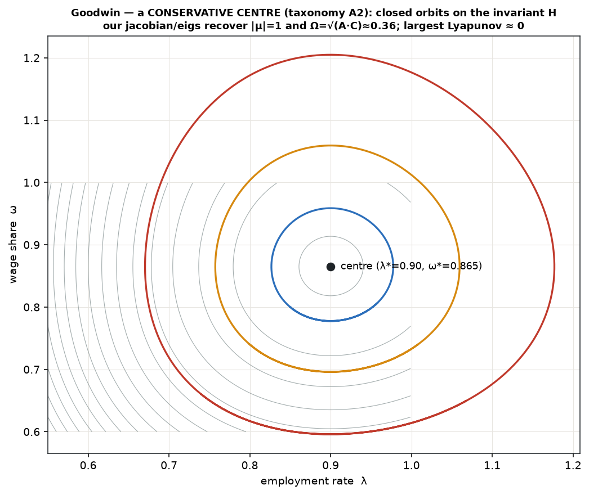
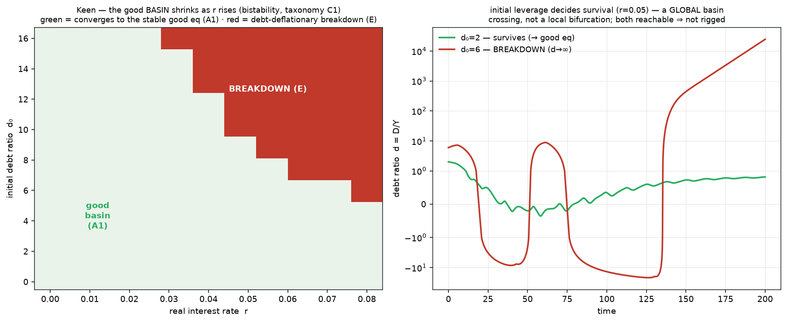
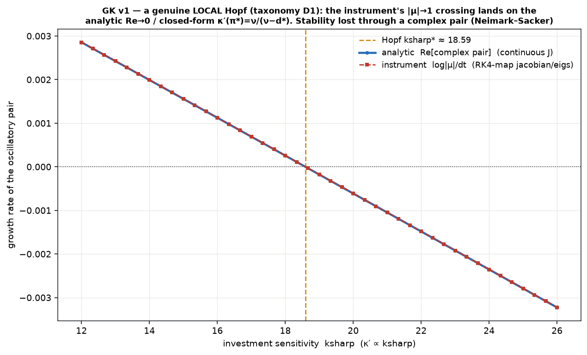
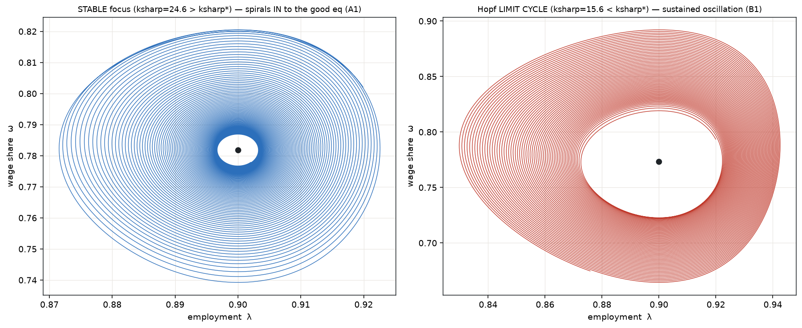

# Goodwin–Keen — the classifier arc's instrument self-test rung ("the hydrogen atom")

> **Verdict: our `src/chaos/` diagnostics (`linearize` + `lyapunov`) recover the KNOWN answers of a
> benchmark whose classes are analytically settled — so they are trusted before we point them at the
> coupled SFC substrate.** (The 3rd instrument, the bifurcation sweeper, is self-tested in its own
> module on the logistic cascade; this rung exercises the two its self-tests require.) This is the
> macro-dynamics analogue of the chaos suite's logistic λ=ln2 check, and it is **Steve Keen's own
> model**, so it doubles as the concrete debt-dynamics artifact.

The [taxonomy principles](../../research/notes/concepts/taxonomy-principles.md) (Next-step 3) require
every diagnostic to be self-tested on a benchmark with a known class before the substrate. The
[registry](../../research/notes/concepts/taxonomy.md) names the classes. This module instantiates
several of them against ground truth and checks the instruments read them correctly.

```bash
cd src/goodwin_keen
python3 run_v0.py     # nested → conservation → eigenvalues → Lyapunov → Keen bistability → determinism
```

## The model

State `s = [ω, λ, d]` — wage share, employment rate, debt ratio `D/Y`.

```
π  = 1 − ω − r·d                 g  = κ(π)/ν − δ
ω̇ = ω·(φ(λ) − α)                 λ̇ = λ·(g − α − β)                ḋ = κ(π) − π − d·g
φ(λ) = −γ + ρλ (linear Phillips)   κ(π) = π (Goodwin)  |  bounded sigmoid (Keen)
```

**Goodwin** (`keen=False`, `r=δ=0`, `d≡0`) is the classic 2-D predator–prey system — a
*conservative centre*. **Keen** adds debt and a bounded investment appetite: a stable "good"
equilibrium that coexists with a debt-deflationary breakdown.

## What the instruments recover (all from `run_v0.py`)

| # | Self-test | Result | Known answer |
|---|---|---|---|
| 0 | nesting (regression guard) | max\|Δ(ω,λ,d)\| = **0.0** | Keen(κ=id,r=δ=0,d₀=0) ≡ Goodwin, byte-exact by construction (same `_rhs` at d=0) |
| 1 | conservation | worst \|ΔH\| = **4.4e-14** | Lotka–Volterra invariant H is constant (on a real ~19% orbit, not the fixed point) |
| 2 | eigenvalues (`jacobian`/`eigs`) | \|μ\| = **1.000000**, Ω = **0.3602** | centre; Ω = √(A·C) = **0.3602**; 3rd (real) d-eig ≈ 0.9996 contracts |
| 3 | Lyapunov (`largest_lyapunov`) | λ = **−0.00000**/step | conservative centre → 0 (vs logistic ln2) |
| 4 | Keen bistability | good eq stable (\|μ\|<1); d₀* = **9.9 → 3.2** as r: 0.02→0.05 | stable good eq + breakdown basin; r shrinks it |
| 5 | determinism | **byte-identical** | σ=0 |



*The larger orbits reach ω, λ > 1 (wage share / employment above 100%) — illustrative Lotka–Volterra
math orbits, not economically bounded. This is a mathematical benchmark for the instruments, not an
economic claim (see "not empirical" below).*

## Mapping onto the taxonomy registry (the point of the rung)

- **A2 — structurally non-hyperbolic equilibrium.** Goodwin's equilibrium is a *centre*: the
  (ω,λ) Jacobian has zero trace **for any** linear-Phillips config, so the continuous eigenvalues
  are pure-imaginary and `|μ|=1` (marginal, ∀ parameters — exact for the continuous centre; the
  finite-difference RK4 *map* our `jacobian`/`eigs` see returns 1.0000005, i.e. |μ|=1 to 6 digits).
  The conserved `H` is the reason — the same conservation-⇒-non-hyperbolic story as the chaos core
  (CYB-2/4), one dimension down.
- **B1 — bounded limit cycle.** The closed orbits around the centre (the figure); largest Lyapunov
  ≈ 0 confirms neutral stability (neither the chaotic λ>0 nor the damped λ<0 of the logistic
  self-tests).
- **A1 — stable equilibrium.** Keen's good equilibrium is a genuine (if slow: e-folding ~108 time
  units) spiral sink, `|μ|<1` — recovered by `fixed_point_newton` + `eigs`.
- **C1 → E — bistability to escape.** A debt-deflationary breakdown basin (d→∞, ω→0, λ→0)
  coexists with the good basin; **initial leverage decides survival**, and a higher interest rate
  **shrinks the good basin** (d₀* falls). Crucially the breakdown is reached by crossing a
  finite-amplitude **basin boundary — a *global* event, not a local eigenvalue crossing** — the
  same distinction (D2 global vs D1 local) the taxonomy draws and the chaos core exhibits.



## v1 (CYB-35) — a genuine LOCAL Hopf, recovered two ways (`run_v1.py`)

v0 caught centres (`|μ|=1`) and a *global* basin; it had no *local* bifurcation for `linearize` to
catch. v1 supplies one — a genuine **Hopf** (Neimark–Sacker on the RK4 map) with a **closed-form**
threshold, so it is a self-test, not a demo.

**The known answer (derived, not guessed).** At the Keen good equilibrium `∂ω̇/∂ω = ∂λ̇/∂λ = 0`
for *any* Phillips shape, and the 3×3 Routh–Hurwitz Hopf condition `a₁a₂ = a₃` reduces **exactly**
to `J₁₂·J₂₃·J₃₁ = 0`. Since `J₁₂ = ω*φ'(λ*) ≠ 0` and `J₂₃ = −λ*rκ'/ν ≠ 0`, the Hopf is where
**`J₃₁ = 0`, i.e. `κ'(π*) = ν/(ν − d*)`** — a closed-form locus. Sweeping the **investment
sensitivity `ksharp`** (κ' ∝ ksharp):

| threshold, three independent ways | value |
|---|---|
| analytic — continuous-Jacobian `Re[complex pair] → 0` | ksharp\* = **18.591** |
| closed-form — `κ'(π*) = ν/(ν − d*)` (`J₃₁ = 0`) | ksharp\* = **18.591** |
| instrument — RK4-map `|μ| → 1` (`jacobian`/`eigs`) | ksharp\* = **18.591** (Δ = **0.00%**) |

The crossing eigenvalue is **complex** (`μ = 0.99998 + 0.00563i`) ⇒ a true Neimark–Sacker. Both
sides are reachable (not rigged): above ksharp\* a **stable focus** (spirals in, `|s−eq|` 1.7e-2 →
3.3e-4); below, a **Hopf-born limit cycle** (sustained). Nesting (`phillips_convex=False` ⇒ v0
byte-exact) and determinism hold.




**Honest finding — the Hopf is *not* a Phillips-convexity effect.** The locus `κ'(π*) = ν/(ν−d*)`
is **independent of the Phillips curve** (`φ'` cancels in `a₁a₂−a₃`). The local Hopf is driven by
**investment sensitivity (`κ'`, i.e. `ksharp`) × the debt coupling** — Minsky, not the wage curve.
The convex Phillips is added (flagged) as Keen's canonical form and the demo runs with it on, but
the mechanism, honestly, is `ksharp`. **Taxonomy:** this is a **validated instance of class D1
(local bifurcation)** — which the registry previously held only as *tested-and-rejected* (the chaos
core) plus the logistic benchmark — complementing v0's A2 centre and handing off, past the cycle,
to v0's C1→E breakdown basin ([registry](../../research/notes/concepts/taxonomy.md)).

## Honest notes / scope

- **v0 is minimal, not canonical-Keen; v1 adds the canonical convex Phillips (flagged).** In v0 the
  linear Phillips (ω,λ) block is a structural centre, so its debt-deflation is a *global* basin
  phenomenon. v1 supplies the *local* Hopf — and shows it is an investment-sensitivity/debt effect,
  Phillips-shape-independent (above). Some good-equilibria on the low-`ksharp` side carry a mildly
  *negative* `d*` (firms net creditors) — a valid math point of the benchmark, not an economic claim.
- **Not empirical.** This is a benchmark with analytic answers (structural reproducibility), not a
  claim about any real economy. Empirical validation is the withheld-episode work still ahead.
- **Entry rung only.** Passing here licenses the instruments for the next rung — the coupled,
  conserved SFC substrate (CYB-26…29 territory), where the classes are *not* known in advance.

## Files

- `model.py` — `GKParams` (incl. the flagged v1 convex Phillips); the RK4 map `gk_step` (the
  `StepFn` the chaos instruments consume); the independent 2-D Goodwin step (nesting); `conserved_H`;
  analytic `goodwin_equilibrium`/`goodwin_frequency` (v0) and `keen_good_equilibrium`,
  `continuous_jacobian`, `kappa_prime`, `hopf_locus_residual` (v1).
- `run_v0.py` — the six self-tests + 2 figures; loads `../chaos/{linearize,lyapunov}.py` unchanged
  (read-only). (The bifurcation sweeper is self-tested in its own module — the logistic cascade.)
- `run_v1.py` — the local-Hopf self-test (analytic + closed-form + instrument thresholds agree) +
  nesting (imports `run_v0`) + both-sides + determinism; loads `../chaos/linearize.py` (read-only).
- `figures/` — v0: the Goodwin centre (closed orbits on H); the Keen (r, d₀) basin. v1: the Hopf
  (three thresholds vs ksharp); the stable-focus-vs-limit-cycle phase portraits.

## Anchors

Goodwin (1967, the growth cycle). Keen (1995, *Finance and economic breakdown* — the Minsky debt
extension). Lotka–Volterra (the conserved centre). Instruments: `src/chaos/` (CYB-2/4); the taxonomy
registry (`research/notes/concepts/taxonomy.md`). Descriptive only — no policy/normative content.
