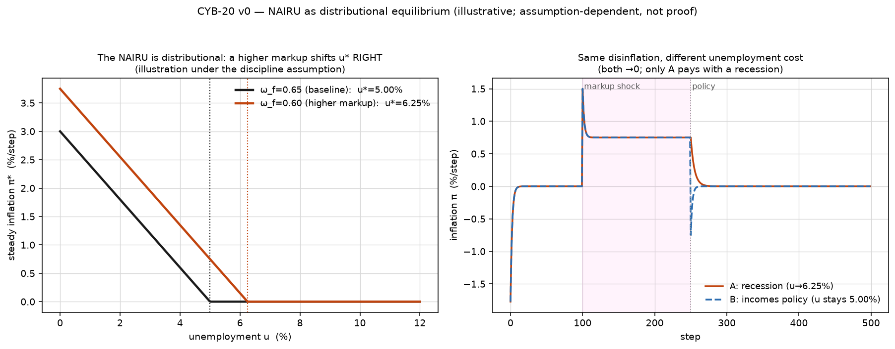
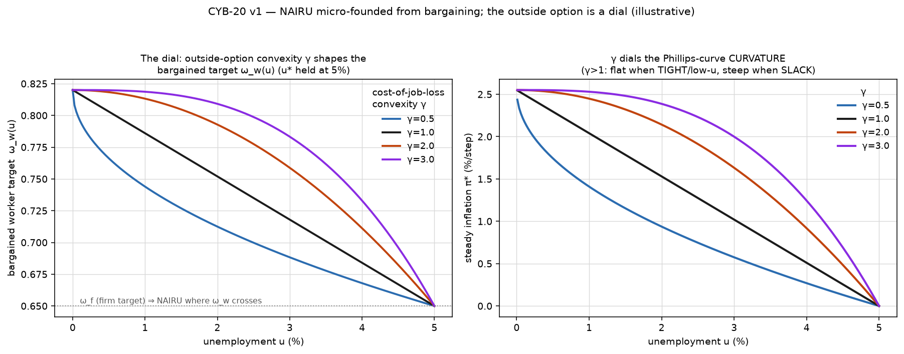

# The NAIRU as a distributional equilibrium (CYB-20)

> **An illustration under an explicit, contestable assumption — not a proof, not an empirical claim
> about any economy.** Ticket: **CYB-20** (sibling of the expectations channel). Built on **CYB-6**
> (`conflict/`), a Rowthorn model, unchanged.

```bash
cd src/nairu
python3 run_v0.py   # reproduce → the assumption → the divergence → the policy trajectories
```

## The claim, and the honest register it's made in

Orthodox macro treats the natural rate of unemployment **u\*** as a *technical/frictional constant*
— set by search, matching, mismatch, demographics — and therefore invariant to how the pie is
divided. This module makes vivid the **conflict / Kaleckian** alternative (Kalecki 1943, *Political
Aspects of Full Employment*; Rowthorn 1977; the Bowles–Gordon–Weisskopf "cost of job loss"): that
u\* is instead the **distributional equilibrium** — the level of worker disempowerment that closes
the aspiration gap so prices stabilise.

**On epistemic status (read this).** The frictional NAIRU is itself an *illustration* — a coherent
story, dressed as a constant, whose policy corollary is that disinflation requires unemployment (hold
`u` at/above `u*`); it has no clean proof either. This is the
*same illustrative mode*, drawn with a **finer pen**: the accounting closes (conservation < 1e-9), the
orthodox result is reproduced to **machine precision** as a special case, the load-bearing assumption
is **named**, and its consequences are traced **deterministically** (byte-identical reruns) and
**sim-verified** against the closed form. A finer pen does **not** make the mechanism *true* — a crisp
drawing of the wrong gear-train is still wrong. What it buys is the thing the Sharpie curves lack:
**clean falsifiability** — flip the assumption, rerun, and it breaks unambiguously (as Fisher's corner,
recursion's artifact, and the WID walls did elsewhere in this project). It can be wrong *on purpose*.

## The one assumption (the entire load-bearing content)

Everything else is CYB-6. The single addition is a **discipline function** — the worker target share
falls with unemployment:

```
ω_w(u) = ω_w0 − b·u            # ω_w0 = full-employment target (militancy); b = discipline slope
g(u)   = ω_w(u) − ω_f          # the aspiration gap; ω_f = firms' markup target (firm power)
```

CYB-6 then transmits the gap: steady `π*(u) = c·g(u)` for `g>0` (`c = α_wα_p/(α_w+α_p)`), and `0`
at/above the point where the gap closes (the nominal-wage floor binds). **That closing point is the
NAIRU:** `u* = (ω_w0 − ω_f)/b`.

## Reproduce → assumption → divergence

**① Orthodox special case (reproduced, sim-verified to ~1e-16).** A NAIRU `u*=5.0%` with a
downward-sloping Phillips curve below it and price stability at/above it — the textbook shape.

**② The assumption named.** Orthodoxy's `u*` is a technical constant, invariant to distribution.

**③ The divergence.** `u* = (ω_w0−ω_f)/b` is a *function of the distributional parameters* — it rises
with the firm markup target (`ω_f↓`) and with worker militancy (`ω_w0↑`):

| ω_f (markup) | u\* | | ω_w0 (militancy) | u\* |
|---|---|---|---|---|
| 0.70 | 3.75% | | 0.80 | 3.75% |
| 0.65 | 5.00% | | 0.85 | 5.00% |
| 0.60 | 6.25% | | 0.90 | 6.25% |
| 0.55 | 7.50% | | 0.95 | 7.50% |

No friction anywhere. Same object, different *nature*.



## The policy lever orthodoxy's constant-u\* forbids (dynamical illustration)

After a markup shock (`ω_f: 0.65→0.60`) raises `u*` from 5.0% to 6.25%, `run_v0` plays two
disinflation paths as **real trajectories**:

- **A — recession (orthodox):** raise unemployment to the new `u*=6.25%` → the gap closes → inflation
  subsides.
- **B — incomes policy (conflict):** hold unemployment at **5.0%** and compress the gap (restore the
  markup) → the gap closes → inflation subsides, **no recession.**

Both kill the inflation; only A pays in unemployment. **This is a consequence of the assumption,
offered as illustration** — whether real economies work through the discipline channel (ours) or the
frictional one (theirs) is exactly what is *not* settled here.

## Self-tests (all from `run_v0.py`)

| # | test | result |
|---|---|---|
| 0 | reproduction | sim steady π == closed form `c·g(u)`, worst Δ = **8.3e-17** |
| 1 | conservation | wage+profit partition 1 on a real trajectory, residual **0.0** (< 1e-9) |
| 2 | orthodox case | NAIRU `u*=5.0%`, Phillips curve reproduced |
| 3–4 | divergence | `u*=(ω_w0−ω_f)/b` shifts with ω_f and ω_w0 (3.75%→7.50%) |
| 5 | policy | recession vs incomes-policy trajectories, both π→0; only A raises u |
| 6 | determinism | byte-identical rerun |

## v1 — micro-founded from bargaining; the outside option is a dial (`run_v1.py`)

v0's discipline function `ω_w(u)=ω_w0−b·u` is exactly the objection a mainstream economist reaches
for: *ad hoc*. v1 answers it — the target is **derived** from Nash / McDonald–Solow wage bargaining,
with the outside option (the **cost of job loss**) an explicit, dial-able parameterization:

```
cjl(u)      = k · u^γ                 # γ = cost-of-job-loss CONVEXITY dial
ω_threat(u) = ω_e − cjl(u)            # worker fallback (reemployed share minus the cost)
ω_w(u)      = β·C + (1−β)·ω_threat(u)  # bargained target (β = worker power, C = ceiling)
```

- **The "ad hoc" form was the bargaining solution.** At **γ=1** this reduces *exactly* to v0's linear
  `ω_w(u)=ω_w0−b·u` (`ω_w0=β·C+(1−β)ω_e`, `b=(1−β)k`) — matched to **1.1e-16**, u\* identical. So the
  *specific* "why that linear shape?" objection is answered — the shape is the optimizing outcome. (The
  broader assumption isn't removed, only relocated — see below.)
- **u\* depends on BOTH frictions and power, from one optimizing model.** Frictional levers (cost of
  job loss `k`: 7.08→4.25%; reemployed share `ω_e`: 4.69→5.94%) *and* power levers (worker power `β`:
  3.75→7.92%; firm markup `ω_f`: 3.75→6.88%). It **reproduces** the frictional u\* and **carries** the
  distributional dependence the frictional story omits — legs 1+2 in a single object they can't call ad hoc.
- **The dial (γ) shapes the Phillips curvature.** Holding u\* fixed (adjusting `k`) so only the *shape*
  moves — slope `|dπ/du| ∝ u^(γ−1)`: γ<1 concave (**steep when TIGHT / near full employment**, flat when
  slack), γ=1 linear, **γ>1 convex — flat when TIGHT, steep when SLACK**, i.e. it *flattens near full
  employment* (the post-2010 "flat Phillips curve" shape). The *sign* of that curvature is a live
  empirical/**fingerprint** question — γ>1 gives flat-when-tight, γ<1 gives steepening-when-tight; which
  the real Phillips curve shows is the open question, **not** a claim made here.



**Still an illustration.** Micro-founding **relocates** the assumption to bargaining primitives (the
protocol, the outside-option shape γ) the mainstream accepts — it does not remove it, and does not make
it true. The finer pen, one level deeper.

| # (v1) | test | result |
|---|---|---|
| 0 | nesting | γ=1 bargain ≡ v0 linear discipline function, max Δ **1.1e-16**, u\* exact |
| 1 | micro-foundation | ω_w(u) derived; sim π == closed form, worst Δ **3.4e-17** |
| 2 | decomposition | u\* moves with frictions (k, ω_e) AND power (β, ω_f) |
| 3 | γ dial | concave (γ<1) ↔ linear (γ=1) ↔ convex/flat-then-steep (γ>1) |
| 4 | determinism | byte-identical; conservation residual **0.0** |

## Honest notes / scope

- **v0's discipline function is now DERIVED (v1), not merely posited** — but the bet is *relocated*, not
  removed: it rests on the bargaining protocol and the outside-option shape `γ`, both contestable. A
  different micro-foundation moves everything. The result illustrates a *mechanism*, conditional on those
  primitives.
- **Finer ≠ truer.** Precision and reproducibility buy falsifiability and honesty, not correctness.
- **The frictional NAIRU rests on a different, equally-unproven assumption.** We reproduce it as a
  special case; we do not claim to have discriminated between the two — that is the empirical question,
  untouched here (and possibly wall-bound, cf. the WID work).
- **Reproduces a known heterodox result** (the conflict NAIRU); the value here is the rigorous,
  falsifiable, orthodox-as-special-case framing, not a new economic result. Genuine innovation would be
  a further step (the expectations/de-anchoring interaction — v2 — or a distinct testable comparative
  static: does u\* co-move with labour-share/union-density rather than demographics?).
- **Steady-state u.** `u` is held fixed per run (the NAIRU is a steady-state object); an endogenous
  `u(t)` path is a later cell. **Descriptive only** — no normative content beyond illustrating the
  mechanism.

## Next (v2, scoped)

The **expectations interaction**: below `u*` the gap is open and the CYB-20 expectations channel
(`src/expectations/`) transmits/de-anchors it — reframing the "accelerationist" acceleration as the
*open distributional gap* being amplified, not expectations creating it from nothing. Probed-then-built
the same way. (Also open: micro-founding γ itself from a search/matching job-finding rate.)

## Files

- `model.py` — `NairuParams` (the discipline function + CYB-6 primitives; `nairu`, `steady_pi`,
  `conflict_at`), `NairuEconomy` (a CYB-6 `ConflictEconomy` at a fixed `u`; pure pass-through), and
  `BargainParams` (v1 — the micro-founded discipline function; the outside option as the γ dial).
- `run_v0.py` — the six self-tests + the policy trajectories + the figure; uses `../conflict/model.py`.
- `run_v1.py` — the micro-foundation: nesting (γ=1 ≡ v0), reproduction, the frictions-vs-power
  decomposition, and the γ (outside-option convexity) dial on the Phillips curvature.
- `figures/` — v0: the two Phillips curves (shifting NAIRU) and the recession-vs-incomes-policy paths.
  v1: `..._v1_microfounded.png` (ω_w(u) and the Phillips curve, dialed by γ).

## Anchors

Kalecki 1943 (*Political Aspects of Full Employment*). Rowthorn 1977 (conflict inflation — the base
model). Bowles–Gordon–Weisskopf (cost of job loss). Friedman–Phelps (the frictional natural rate,
reproduced here as a special case). Base: CYB-6 `conflict/`. Descriptive/illustrative only.
